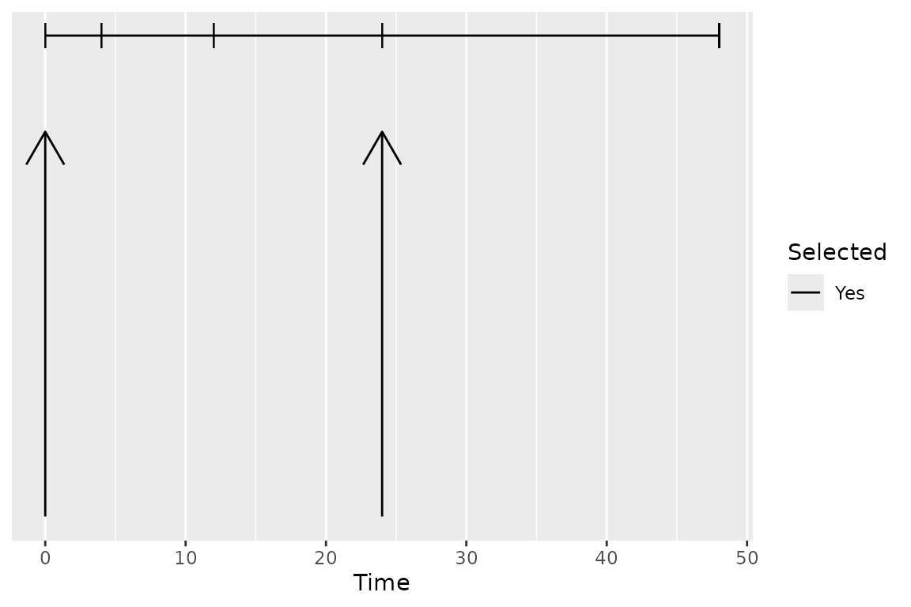
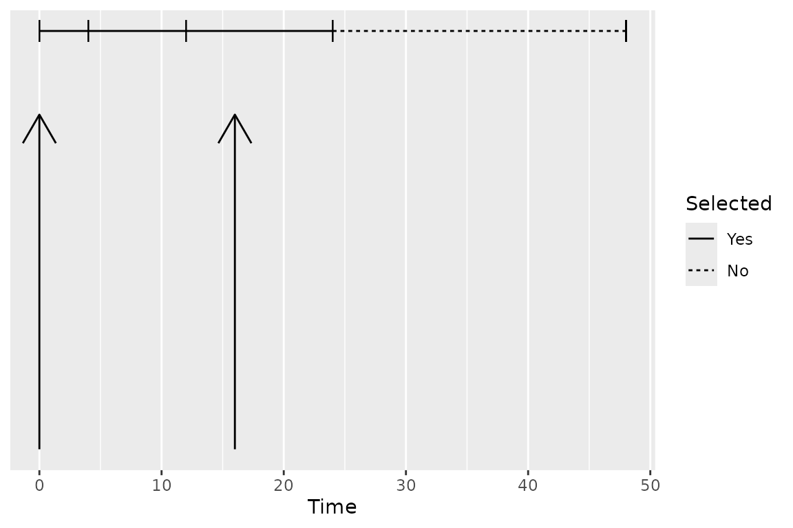

# Selection of Calculation Intervals

## Introduction

PKNCA considers two types of data grouping within data sets: the group
and the interval. A group typically identifies a single subject given a
single intervention type (a “treatment”) with a single analyte. An
interval subsets a group by times within the group, and primary
noncompartmental analysis (NCA) calculations are performed within an
interval.

As a concrete example, consider the figure below shows the
concentration-time profile of a study subject in a multiple-dose study.
The group is all points in the figure, and the interval for the last day
(144 to 168 hr) is the area with blue shading.

    ## Formula for concentration:
    ##  conc ~ time | treatment + ID
    ## Data are dense PK.
    ## With 1 subjects defined in the 'ID' column.
    ## Nominal time column is not specified.
    ## 
    ## First 6 rows of concentration data:
    ##    study treatment ID time      conc   analyte exclude
    ##  Study 1     Trt 1  1    0 0.0000000 Analyte 1    <NA>
    ##  Study 1     Trt 1  1    1 0.6140526 Analyte 1    <NA>
    ##  Study 1     Trt 1  1    2 0.8100022 Analyte 1    <NA>
    ##  Study 1     Trt 1  1    4 0.8425422 Analyte 1    <NA>
    ##  Study 1     Trt 1  1    6 0.7771994 Analyte 1    <NA>
    ##  Study 1     Trt 1  1    8 0.7052469 Analyte 1    <NA>

``` r

# Plot the concentration-time data and the interval
ggplot(d_conc_multi, aes(x=time, y=conc)) +
  geom_ribbon(data=d_conc_multi[d_conc_multi$time >= 144,],
              aes(ymax=conc, ymin=0),
              fill="skyblue") +
  geom_point() + geom_line() +
  scale_x_continuous(breaks=seq(0, 168, by=12)) +
  scale_y_continuous(limits=c(0, NA)) +
  labs(x="Time Since First Dose (hr)",
       y="Concentration\n(arbitrary units)")
```


``` r

intervals_manual <- data.frame(start=144, end=168, auclast=TRUE)
knitr::kable(intervals_manual)
```

| start | end | auclast |
|------:|----:|:--------|
|   144 | 168 | TRUE    |

``` r

d_conc_multi_obj <- PKNCAconc(d_conc_multi, conc~time|treatment+ID)
PKNCAdata(d_conc_multi_obj, intervals=intervals_manual)
```

    ## Formula for concentration:
    ##  conc ~ time | treatment + ID
    ## Data are dense PK.
    ## With 1 subjects defined in the 'ID' column.
    ## Nominal time column is not specified.
    ## 
    ## First 6 rows of concentration data:
    ##  treatment ID      conc time exclude
    ##      Trt 1  1 0.0000000    0    <NA>
    ##      Trt 1  1 0.6140526    1    <NA>
    ##      Trt 1  1 0.8100022    2    <NA>
    ##      Trt 1  1 0.8425422    4    <NA>
    ##      Trt 1  1 0.7771994    6    <NA>
    ##      Trt 1  1 0.7052469    8    <NA>
    ## No dosing information.
    ## 
    ## With 1 rows of interval specifications.
    ## With imputation: NA
    ## No options are set differently than default.

## Group Matching

Group matching occurs by matching all overlapping column names between
the groups and the interval data.frame. (Note that grouping columns
cannot be the word `start`, `end`, or share a name with an NCA
parameter.)

### Selecting the Subjects for an Interval

The groups for an interval prepare for summarization. Typically the
groups will take a structure similar to the preferred summarization
structure with groups nested in the logical method for summary. As an
example, the group structure may be: study, treatment, day, analyte, and
subject. The grouping names for an interval must be the same as or a
subset of the grouping names used for the concentration data.

As the matching occurs with all available columns, the grouping columns
names are only required to the level of specificity for the calculations
desired. As an example, if you want AUC_(inf,obs) in subjects who
received single doses and AUC_(last) on days 1 (0 to 24 hours) and 10
(216 to 240 hours) in subjects who received multiple doses, with
treatment defined as “Drug 1 Single” or “Drug 1 Multiple”, the intervals
could be defined as below.

``` r

intervals_manual <-
  data.frame(
    treatment=c("Drug 1 Single", "Drug 1 Multiple", "Drug 1 Multiple"),
    start=c(0, 0, 216),
    end=c(Inf, 24, 240),
    aucinf.obs=c(TRUE, FALSE, FALSE),
    auclast=c(FALSE, TRUE, TRUE)
  )
knitr::kable(intervals_manual)
```

| treatment       | start | end | aucinf.obs | auclast |
|:----------------|------:|----:|:-----------|:--------|
| Drug 1 Single   |     0 | Inf | TRUE       | FALSE   |
| Drug 1 Multiple |     0 |  24 | FALSE      | TRUE    |
| Drug 1 Multiple |   216 | 240 | FALSE      | TRUE    |

## Intervals

Intervals are defined by `data.frame`s with one row per interval, zero
or more columns to match the groups from the `PKNCAdata` object, and one
or more NCA parameters to calculate. An interval may also have an
`impute` column specifying the data imputation method(s) to apply to the
interval before calculation (see the Data Imputation vignette for
details). An interval may have a `tau` column giving the dosing interval
for the multiple-dose parameters (see Multiple-Dose MRT and Vss below).
Any other columns named in the `keep_interval_cols` PKNCA option are
passed through from the intervals to the corresponding rows of the
results.

Selection of points within an interval occurs by choosing any point at
or after the `start` and at or before the `end`.

### To Infinity

The end of an interval may be infinity. An interval to infinity works
the same as any other interval in that points are selected by being at
or after the `start` and at or before the `end` of the interval.
Selecting `Inf` or any value at or after the maximum time yields no
difference in effect, but `Inf` is simpler when scripting to ensure that
all points are selected.

    ## Formula for concentration:
    ##  conc ~ time | treatment + ID
    ## Data are dense PK.
    ## With 1 subjects defined in the 'ID' column.
    ## Nominal time column is not specified.
    ## 
    ## First 6 rows of concentration data:
    ##    study treatment ID time      conc   analyte exclude
    ##  Study 1     Trt 1  1    0 0.0000000 Analyte 1    <NA>
    ##  Study 1     Trt 1  1    1 0.6140526 Analyte 1    <NA>
    ##  Study 1     Trt 1  1    2 0.8100022 Analyte 1    <NA>
    ##  Study 1     Trt 1  1    4 0.8425422 Analyte 1    <NA>
    ##  Study 1     Trt 1  1    6 0.7771994 Analyte 1    <NA>
    ##  Study 1     Trt 1  1    8 0.7052469 Analyte 1    <NA>

``` r

# Use superposition to simulate multiple doses
ggplot(as.data.frame(d_conc)[as.data.frame(d_conc)$time <= 48,], aes(x=time, y=conc)) +
  geom_ribbon(data=as.data.frame(d_conc),
              aes(ymax=conc, ymin=0),
              fill="skyblue") +
  geom_point() + geom_line() +
  scale_x_continuous(breaks=seq(0, 72, by=12)) +
  scale_y_continuous(limits=c(0, NA)) +
  labs(x="Time Since First Dose (hr)",
       y="Concentration\n(arbitrary units)")
```


``` r

intervals_manual <-
  data.frame(
    start=0,
    end=Inf,
    auclast=TRUE,
    aucinf.obs=TRUE
  )
print(intervals_manual)
```

    ##   start end auclast aucinf.obs
    ## 1     0 Inf    TRUE       TRUE

``` r

my.data <- PKNCAdata(d_conc, intervals=intervals_manual)
```

### Multiple Intervals

More than one interval may be specified for the same subject or group of
subjects by providing more than one row of interval specifications. In
the figure below, the blue and green shaded regions indicate the first
and second rows of the intervals, respectively.

    ## Formula for concentration:
    ##  conc ~ time | treatment + ID
    ## Data are dense PK.
    ## With 1 subjects defined in the 'ID' column.
    ## Nominal time column is not specified.
    ## 
    ## First 6 rows of concentration data:
    ##    study treatment ID time      conc   analyte exclude
    ##  Study 1     Trt 1  1    0 0.0000000 Analyte 1    <NA>
    ##  Study 1     Trt 1  1    1 0.6140526 Analyte 1    <NA>
    ##  Study 1     Trt 1  1    2 0.8100022 Analyte 1    <NA>
    ##  Study 1     Trt 1  1    4 0.8425422 Analyte 1    <NA>
    ##  Study 1     Trt 1  1    6 0.7771994 Analyte 1    <NA>
    ##  Study 1     Trt 1  1    8 0.7052469 Analyte 1    <NA>

``` r

# Plot the concentration-time data and the interval
ggplot(d_conc_multi, aes(x=time, y=conc)) +
  geom_ribbon(data=d_conc_multi[d_conc_multi$time <= 24,],
              aes(ymax=conc, ymin=0),
              fill="skyblue") +
  geom_ribbon(data=d_conc_multi[d_conc_multi$time >= 144,],
              aes(ymax=conc, ymin=0),
              fill="lightgreen") +
  geom_point() + geom_line() +
  scale_x_continuous(breaks=seq(0, 168, by=12)) +
  scale_y_continuous(limits=c(0, NA)) +
  labs(x="Time Since First Dose (hr)",
       y="Concentration\n(arbitrary units)")
```


``` r

intervals_manual <-
  data.frame(
    start=c(0, 144),
    end=c(24, 168),
    auclast=TRUE
  )
knitr::kable(intervals_manual)
```

| start | end | auclast |
|------:|----:|:--------|
|     0 |  24 | TRUE    |
|   144 | 168 | TRUE    |

``` r

d_conc_multi_obj <- PKNCAconc(d_conc_multi, conc~time|treatment+ID)
my.data <- PKNCAdata(d_conc_multi_obj, intervals=intervals_manual)
```

## Overlapping Intervals and Different Calculations by Interval

In some scenarios, multiple intervals may be needed where some intervals
overlap. There is no issue with an interval specification that has two
rows with overlapping times; the rows are considered separately. In the
example below, the 0-24 interval is shared between both the first and
second (shaded blue-green).

The example of overlapping intervals also illustrates that different
calculations can be performed in different intervals. In this case,
`auclast` is calculated in both intervals while `aucinf.obs` is only
calculated in the 0-Inf interval.

    ## Formula for concentration:
    ##  conc ~ time | treatment + ID
    ## Data are dense PK.
    ## With 1 subjects defined in the 'ID' column.
    ## Nominal time column is not specified.
    ## 
    ## First 6 rows of concentration data:
    ##    study treatment ID time      conc   analyte exclude
    ##  Study 1     Trt 1  1    0 0.0000000 Analyte 1    <NA>
    ##  Study 1     Trt 1  1    1 0.6140526 Analyte 1    <NA>
    ##  Study 1     Trt 1  1    2 0.8100022 Analyte 1    <NA>
    ##  Study 1     Trt 1  1    4 0.8425422 Analyte 1    <NA>
    ##  Study 1     Trt 1  1    6 0.7771994 Analyte 1    <NA>
    ##  Study 1     Trt 1  1    8 0.7052469 Analyte 1    <NA>

``` r

# Use superposition to simulate multiple doses
ggplot(as.data.frame(d_conc), aes(x=time, y=conc)) +
  geom_ribbon(data=as.data.frame(d_conc),
              aes(ymax=conc, ymin=0),
              fill="lightgreen",
              alpha=0.5) +
  geom_ribbon(data=as.data.frame(d_conc)[as.data.frame(d_conc)$time <= 24,],
              aes(ymax=conc, ymin=0),
              fill="skyblue",
              alpha=0.5) +
  geom_point() + geom_line() +
  scale_x_continuous(breaks=seq(0, 168, by=12)) +
  scale_y_continuous(limits=c(0, NA)) +
  labs(x="Time Since First Dose (hr)",
       y="Concentration\n(arbitrary units)")
```


``` r

intervals_manual <-
  data.frame(
    start=0,
    end=c(24, Inf),
    auclast=TRUE,
    aucinf.obs=c(FALSE, TRUE)
  )
knitr::kable(intervals_manual)
```

| start | end | auclast | aucinf.obs |
|------:|----:|:--------|:-----------|
|     0 |  24 | TRUE    | FALSE      |
|     0 | Inf | TRUE    | TRUE       |

``` r

my.data <- PKNCAdata(d_conc, intervals=intervals_manual)
```

## Intervals with Duration

Some events have durations of times rather than instants in time
associated with them. Two typical examples of duration data in NCA are
intravenous infusions and urine or fecal sample collections. Inform
PKNCA of durations with the `duration` argument to the `PKNCAdose` and
`PKNCAconc` functions.

Duration data are selected for an interval by the event time, which is
the time of the start of the duration (for example, the start of a urine
collection). Like any other data point, a duration record is selected
when its start time is at or after the interval `start` and at or before
the interval `end`; the end of the duration is not considered. A
collection that starts within the interval and ends after the interval
`end` is therefore selected, and it contributes its full amount to
calculations within the interval (the amount is not pro-rated to the
portion of the duration inside the interval). For the simplest
interpretation of results, align collection start and end times with the
interval boundaries.

The figures below show which durations are selected for two intervals.
The vertical arrows indicate the interval `start` and `end`, and each
horizontal segment is a duration (for example, a urine collection) with
tick marks at the collection boundaries. In the first figure, the
interval is from 0 to 24, and all four durations are selected, including
the duration from 24 to 48 because its start time is exactly at the
interval `end`. In the second figure, the interval is from 0 to 16: the
duration from 12 to 24 is selected because its start time is within the
interval, even though the collection extends past the interval `end`
(and its full amount contributes to the interval), while the duration
from 24 to 48 is not selected.



## Multiple-Dose MRT and Vss

The multiple-dose parameters `mrt.md.obs`, `mrt.md.pred`, `vss.md.obs`,
and `vss.md.pred` measure MRT and Vss over a steady-state dosing
interval instead of over a single dose.

**These are the parameters to use when PK are nonlinear.** When PK are
linear, MRT and Vss can be measured from a single dose, and the
single-dose parameters (`mrt.obs`, `vss.obs`, and similar) describe
steady state as well. When PK are nonlinear they do not: clearance and
volume at steady state differ from their values after the first dose, so
MRT and Vss have to be measured over a steady-state interval.

Taking `mrt.last` over a dosing interval is not a substitute. `AUMC`
divided by `AUC` over 0 to tau leaves out the drug still in the body at
the end of the interval and underestimates MRT substantially. The
multiple-dose parameters add the `tau*(AUCinf - AUCtau)/AUCtau` term
that accounts for it.

The dosing interval comes from a `tau` column in the interval
specification, and that column takes precedence whenever it is given:

``` r

intervals_md <-
  data.frame(
    start=0, end=24,
    tau=24,
    mrt.md.obs=TRUE, vss.md.obs=TRUE
  )
```

When no `tau` column is given, `tau` is detected from the dose times
with
[`find.tau()`](https://humanpred.github.io/pknca/reference/find.tau.md),
which needs at least two doses in the dosing data. A steady-state design
that records only the profiled dose has nothing that repeats, so it
needs the `tau` column. If `tau` can be neither given nor detected, the
parameters are `NA` with a warning rather than silently falling back to
the single-dose equation.

### Intravenous Infusions

For an IV infusion, use `mrt.ivmd.obs`, `mrt.ivmd.pred`, `vss.ivmd.obs`,
and `vss.ivmd.pred` instead. They subtract half of the infusion
duration, the same correction that `mrt.iv.obs` applies to the
single-dose MRT. Without it, MRT is high by half the infusion duration
and Vss is high by clearance times half the infusion duration.

## Parameters Available for Calculation in an Interval

The following parameters are available in an interval. For more
information about the parameter, see the documentation for the function.

| Parameter Name | Formula | Formula Note | Unit Type | Parameter Description | Function for Calculation |
|:---|:---|:---|:---|:---|:---|
| adj_tobit_residual |  |  | unitless | Adjusted Tobit residual SD | See the parameter name half.life |
| adj.r.squared | $`r^2_{adj} = 1 - (1 - r^2) \frac{n-1}{n-2}`$ |  | unitless | Adjusted R-sq of half-life fit | See the parameter name half.life |
| ae | $`AE = \sum_i C_i V_i`$ |  | amount | Amount excreted (urine/feces) | pk.calc.ae |
| aucabove.predose.all | $`AUC_{\text{above,predose}} = \int \max(C(t) - C_{\text{start}},\; 0)\; dt`$ |  | auc | AUC above predose, floor at 0 | pk.calc.aucabove |
| aucabove.trough.all | $`AUC_{\text{above,trough}} = \int \max(C(t) - C_{\text{trough}},\; 0)\; dt`$ |  | auc | AUC above trough, floor at 0 | pk.calc.aucabove |
| aucall | $`AUC_{\text{all}} = \sum_{k} AUC_k(C_k, C_{k+1}, t_k, t_{k+1})`$ | Trapezoidal rule (linear-up/log-down by default) | auc | AUClast plus triangle, 0 at BLQ | pk.calc.auc.all |
| aucall.dn | $`AUC_{\text{all},dn} = \frac{AUC_{\text{all}}}{Dose}`$ |  | auc_dosenorm | Dose normalized aucall | pk.calc.dn |
| aucinf.obs | $`AUC_{\infty,\text{obs}} = AUC_{0-\text{last}} + \frac{C_{\text{last,obs}}}{\lambda_z}`$ |  | auc | AUC start to inf, obs Clast extrap | pk.calc.auc.inf.obs |
| aucinf.obs.dn | $`AUC_{\infty,\text{obs},dn} = \frac{AUC_{\infty,\text{obs}}}{Dose}`$ |  | auc_dosenorm | Dose normalized aucinf.obs | pk.calc.dn |
| aucinf.pred | $`AUC_{\infty,\text{pred}} = AUC_{0-\text{last}} + \frac{C_{\text{last,pred}}}{\lambda_z}`$ |  | auc | AUC start to inf, pred Clast extrap | pk.calc.auc.inf.pred |
| aucinf.pred.dn | $`AUC_{\infty,\text{pred},dn} = \frac{AUC_{\infty,\text{pred}}}{Dose}`$ |  | auc_dosenorm | Dose normalized aucinf.pred | pk.calc.dn |
| aucint.all | $`AUC_{\text{int,all}} = \sum_{k} AUC_k(C_k, C_{k+1}, t_k, t_{k+1})`$ | Trapezoidal rule with interpolation at interval boundaries | auc | AUC from T1 to T2 (AUCall extrap) | pk.calc.aucint.all |
| aucint.all.dose | $`AUC_{\text{int,all,dose}} = \sum_{k} AUC_k(C_k, C_{k+1}, t_k, t_{k+1})`$ | Trapezoidal rule with interpolation at interval boundaries | auc | AUC T1 to T2, dose-aware (AUCall) | pk.calc.aucint.all |
| aucint.inf.obs | $`AUC_{\text{int,}\infty\text{,obs}} = \sum_{k} AUC_k(C_k, C_{k+1}, t_k, t_{k+1})`$ | Trapezoidal rule with interpolation at interval boundaries | auc | AUC from T1 to T2 (AUCinf,obs extrap) | pk.calc.aucint.inf.obs |
| aucint.inf.obs.dose | $`AUC_{\text{int,}\infty\text{,obs,dose}} = \sum_{k} AUC_k(C_k, C_{k+1}, t_k, t_{k+1})`$ | Trapezoidal rule with interpolation at interval boundaries | auc | AUC T1 to T2, dose-aware (AUCinf,obs) | pk.calc.aucint.inf.obs |
| aucint.inf.pred | $`AUC_{\text{int,}\infty\text{,pred}} = \sum_{k} AUC_k(C_k, C_{k+1}, t_k, t_{k+1})`$ | Trapezoidal rule with interpolation at interval boundaries | auc | AUC from T1 to T2 (AUCinf,pred extrap) | pk.calc.aucint.inf.pred |
| aucint.inf.pred.dose | $`AUC_{\text{int,}\infty\text{,pred,dose}} = \sum_{k} AUC_k(C_k, C_{k+1}, t_k, t_{k+1})`$ | Trapezoidal rule with interpolation at interval boundaries | auc | AUC T1 to T2, dose-aware (AUCinf,pred) | pk.calc.aucint.inf.pred |
| aucint.last | $`AUC_{\text{int,last}} = \sum_{k} AUC_k(C_k, C_{k+1}, t_k, t_{k+1})`$ | Trapezoidal rule with interpolation at interval boundaries | auc | AUC from T1 to T2 (zero extrap) | pk.calc.aucint.last |
| aucint.last.dose | $`AUC_{\text{int,last,dose}} = \sum_{k} AUC_k(C_k, C_{k+1}, t_k, t_{k+1})`$ | Trapezoidal rule with interpolation at interval boundaries | auc | AUC T1 to T2, dose-aware (zero extrap) | pk.calc.aucint.last |
| aucivall | $`AUC_{\text{iv,all}} = AUC_{\text{all}} + AUC(C_0, t_1) - AUC(C(0), t_1)`$ |  | auc | AUCall, IV back-extrap C0 | pk.calc.auciv |
| aucivinf.obs | $`AUC_{\text{iv,}\infty\text{,obs}} = AUC_{\infty,\text{obs}} + AUC(C_0, t_1) - AUC(C(0), t_1)`$ |  | auc | AUCinf.obs, IV back-extrap C0 | pk.calc.auciv |
| aucivinf.pred | $`AUC_{\text{iv,}\infty\text{,pred}} = AUC_{\infty,\text{pred}} + AUC(C_0, t_1) - AUC(C(0), t_1)`$ |  | auc | AUCinf.pred, IV back-extrap C0 | pk.calc.auciv |
| aucivint.all | $`AUC_{\text{iv,int,all}} = AUC_{\text{int,all}} + AUC(C_0, t_1) - AUC(C(0), t_1)`$ |  | auc | AUCint.all, IV back-extrap C0 | pk.calc.auciv |
| aucivint.last | $`AUC_{\text{iv,int,last}} = AUC_{\text{int,last}} + AUC(C_0, t_1) - AUC(C(0), t_1)`$ |  | auc | AUCint.last, IV back-extrap C0 | pk.calc.auciv |
| aucivlast | $`AUC_{\text{iv,last}} = AUC_{\text{last}} + AUC(C_0, t_1) - AUC(C(0), t_1)`$ |  | auc | AUClast, IV back-extrap C0 | pk.calc.auciv |
| aucivpbextall | $`\%AUC_{\text{bext,all}} = 100 \cdot \left(1 - \frac{AUC_{\text{all}}}{AUC_{\text{iv,all}}}\right)`$ |  | % | Back-extrap %, IV, AUCall | pk.calc.auciv_pbext |
| aucivpbextinf.obs | $`\%AUC_{\text{bext,}\infty\text{,obs}} = 100 \cdot \left(1 - \frac{AUC_{\infty,\text{obs}}}{AUC_{\text{iv,}\infty\text{,obs}}}\right)`$ |  | % | Back-extrap %, IV, AUCinf.obs | pk.calc.auciv_pbext |
| aucivpbextinf.pred | $`\%AUC_{\text{bext,}\infty\text{,pred}} = 100 \cdot \left(1 - \frac{AUC_{\infty,\text{pred}}}{AUC_{\text{iv,}\infty\text{,pred}}}\right)`$ |  | % | Back-extrap %, IV, AUCinf.pred | pk.calc.auciv_pbext |
| aucivpbextint.all | $`\%AUC_{\text{bext,int,all}} = 100 \cdot \left(1 - \frac{AUC_{\text{int,all}}}{AUC_{\text{iv,int,all}}}\right)`$ |  | % | Back-extrap %, IV, AUCint.all | pk.calc.auciv_pbext |
| aucivpbextint.last | $`\%AUC_{\text{bext,int,last}} = 100 \cdot \left(1 - \frac{AUC_{\text{int,last}}}{AUC_{\text{iv,int,last}}}\right)`$ |  | % | Back-extrap %, IV, AUCint.last | pk.calc.auciv_pbext |
| aucivpbextlast | $`\%AUC_{\text{bext,last}} = 100 \cdot \left(1 - \frac{AUC_{\text{last}}}{AUC_{\text{iv,last}}}\right)`$ |  | % | Back-extrap %, IV, AUClast | pk.calc.auciv_pbext |
| auclast | $`AUC_{\text{last}} = \sum_{k} AUC_k(C_k, C_{k+1}, t_k, t_{k+1})`$ | Trapezoidal rule (linear-up/log-down by default) | auc | AUC start to last conc above LOQ | pk.calc.auc.last |
| auclast.dn | $`AUC_{\text{last},dn} = \frac{AUC_{\text{last}}}{Dose}`$ |  | auc_dosenorm | Dose normalized auclast | pk.calc.dn |
| aucpext.obs | $`\%AUC_{\text{ext,obs}} = 100 \cdot \left(1 - \frac{AUC_{\text{last}}}{AUC_{\infty,\text{obs}}}\right)`$ |  | % | % AUCinf extrap after Tlast, obs | pk.calc.aucpext |
| aucpext.pred | $`\%AUC_{\text{ext,pred}} = 100 \cdot \left(1 - \frac{AUC_{\text{last}}}{AUC_{\infty,\text{pred}}}\right)`$ |  | % | % AUCinf extrap after Tlast, pred | pk.calc.aucpext |
| aumcall | $`AUMC_{\text{all}} = \sum_{k} AUMC_k(C_k, C_{k+1}, t_k, t_{k+1})`$ | Trapezoidal rule (linear-up/log-down by default) | aumc | AUMClast plus triangle moment, 0 at BLQ | pk.calc.aumc.all |
| aumcall.dn | $`AUMC_{\text{all},dn} = \frac{AUMC_{\text{all}}}{Dose}`$ |  | aumc_dosenorm | Dose normalized aumcall | pk.calc.dn |
| aumcinf.obs | $`AUMC_{\infty,\text{obs}} = AUMC_{0-\text{last}} + \frac{C_{\text{last,obs}} T_{\text{last}}}{\lambda_z} + \frac{C_{\text{last,obs}}}{\lambda_z^2}`$ |  | aumc | AUMC start to inf, obs Clast extrap | pk.calc.aumc.inf.obs |
| aumcinf.obs.dn | $`AUMC_{\infty,\text{obs},dn} = \frac{AUMC_{\infty,\text{obs}}}{Dose}`$ |  | aumc_dosenorm | Dose normalized aumcinf.obs | pk.calc.dn |
| aumcinf.pred | $`AUMC_{\infty,\text{pred}} = AUMC_{0-\text{last}} + \frac{C_{\text{last,pred}} T_{\text{last}}}{\lambda_z} + \frac{C_{\text{last,pred}}}{\lambda_z^2}`$ |  | aumc | AUMC start to inf, pred Clast extrap | pk.calc.aumc.inf.pred |
| aumcinf.pred.dn | $`AUMC_{\infty,\text{pred},dn} = \frac{AUMC_{\infty,\text{pred}}}{Dose}`$ |  | aumc_dosenorm | Dose normalized aumcinf.pred | pk.calc.dn |
| aumcint.all | $`AUMC_{\text{int,all}} = \sum_{k} AUMC_k(C_k, C_{k+1}, t_k, t_{k+1})`$ | Trapezoidal rule with interpolation at interval boundaries | aumc | AUMC from T1 to T2 (AUMCall extrap) | pk.calc.aumcint.all |
| aumcint.all.dose | $`AUMC_{\text{int,all,dose}} = \sum_{k} AUMC_k(C_k, C_{k+1}, t_k, t_{k+1})`$ | Trapezoidal rule with interpolation at interval boundaries | aumc | AUMC T1 to T2, dose-aware (AUMCall) | pk.calc.aumcint.all |
| aumcint.inf.obs | $`AUMC_{\text{int,}\infty\text{,obs}} = \sum_{k} AUMC_k(C_k, C_{k+1}, t_k, t_{k+1})`$ | Trapezoidal rule with interpolation at interval boundaries | aumc | AUMC from T1 to T2 (AUMCinf,obs extrap) | pk.calc.aumcint.inf.obs |
| aumcint.inf.obs.dose | $`AUMC_{\text{int,}\infty\text{,obs,dose}} = \sum_{k} AUMC_k(C_k, C_{k+1}, t_k, t_{k+1})`$ | Trapezoidal rule with interpolation at interval boundaries | aumc | AUMC T1 to T2, dose-aware (AUMCinf,obs) | pk.calc.aumcint.inf.obs |
| aumcint.inf.pred | $`AUMC_{\text{int,}\infty\text{,pred}} = \sum_{k} AUMC_k(C_k, C_{k+1}, t_k, t_{k+1})`$ | Trapezoidal rule with interpolation at interval boundaries | aumc | AUMC from T1 to T2 (AUMCinf,pred extrap) | pk.calc.aumcint.inf.pred |
| aumcint.inf.pred.dose | $`AUMC_{\text{int,}\infty\text{,pred,dose}} = \sum_{k} AUMC_k(C_k, C_{k+1}, t_k, t_{k+1})`$ | Trapezoidal rule with interpolation at interval boundaries | aumc | AUMC T1 to T2, dose-aware (AUMCinf,pred) | pk.calc.aumcint.inf.pred |
| aumcint.last | $`AUMC_{\text{int,last}} = \sum_{k} AUMC_k(C_k, C_{k+1}, t_k, t_{k+1})`$ | Trapezoidal rule with interpolation at interval boundaries | aumc | AUMC from T1 to T2 (zero extrap) | pk.calc.aumcint.last |
| aumcint.last.dose | $`AUMC_{\text{int,last,dose}} = \sum_{k} AUMC_k(C_k, C_{k+1}, t_k, t_{k+1})`$ | Trapezoidal rule with interpolation at interval boundaries | aumc | AUMC T1 to T2, dose-aware (zero extrap) | pk.calc.aumcint.last |
| aumcivall |  |  | aumc | AUMCall, IV back-extrap C0 | pk.calc.aumciv |
| aumcivinf.obs |  |  | aumc | AUMCinf.obs, IV back-extrap C0 | pk.calc.aumciv |
| aumcivinf.pred |  |  | aumc | AUMCinf.pred, IV back-extrap C0 | pk.calc.aumciv |
| aumcivint.all |  |  | aumc | AUMCint.all, IV back-extrap C0 | pk.calc.aumciv |
| aumcivint.last |  |  | aumc | AUMCint.last, IV back-extrap C0 | pk.calc.aumciv |
| aumcivlast |  |  | aumc | AUMClast, IV back-extrap C0 | pk.calc.aumciv |
| aumclast | $`AUMC_{\text{last}} = \sum_{k} AUMC_k(C_k, C_{k+1}, t_k, t_{k+1})`$ | Trapezoidal rule (linear-up/log-down by default) | aumc | AUMC start to last conc above LOQ | pk.calc.aumc.last |
| aumclast.dn | $`AUMC_{\text{last},dn} = \frac{AUMC_{\text{last}}}{Dose}`$ |  | aumc_dosenorm | Dose normalized aumclast | pk.calc.dn |
| c0 | $`C_0 = \text{if measured, } C_{t=0}; \text{ else, } C_0 = C_1 \exp\left(-\frac{\ln(C_2) - \ln(C_1)}{t_2-t_1} (t_1 - t_{\text{dose}})\right)`$ | Methods are tried in order: c0, logslope, c1, cmin, set0; the formula shows c0 and logslope | conc | Initial conc after IV bolus | pk.calc.c0 |
| cav | $`C_{av} = \frac{AUC_{\text{last}}}{t_{end} - t_{start}}`$ |  | conc | Avg conc in interval (AUClast) | pk.calc.cav |
| cav.dn | $`C_{av,dn} = \frac{C_{av}}{Dose}`$ |  | conc_dosenorm | Dose normalized cav | pk.calc.dn |
| cav.int.all | $`C_{av,\text{int,all}} = \frac{AUC_{\text{int,all}}}{t_{end} - t_{start}}`$ |  | conc | Avg conc in interval (AUCint.all) | pk.calc.cav |
| cav.int.inf.obs | $`C_{av,\text{int,}\infty\text{,obs}} = \frac{AUC_{\text{int,}\infty\text{,obs}}}{t_{end} - t_{start}}`$ |  | conc | Avg conc in interval (AUCint.inf.obs) | pk.calc.cav |
| cav.int.inf.pred | $`C_{av,\text{int,}\infty\text{,pred}} = \frac{AUC_{\text{int,}\infty\text{,pred}}}{t_{end} - t_{start}}`$ |  | conc | Avg conc in interval (AUCint.inf.pred) | pk.calc.cav |
| cav.int.last | $`C_{av,\text{int,last}} = \frac{AUC_{\text{int,last}}}{t_{end} - t_{start}}`$ |  | conc | Avg conc in interval (AUCint.last) | pk.calc.cav |
| ceoi | $`C_{\text{eoi}} = C(t = T_{\text{inf}})`$ |  | conc | Concentration at the end of infusion | pk.calc.ceoi |
| cl.all | $`CL_{\text{all}} = \frac{Dose}{AUC_{\text{all}}}`$ |  | clearance | Clearance, AUCall | pk.calc.cl |
| cl.int.all | $`CL_{\text{int,all}} = \frac{Dose}{AUC_{\text{int,all}}}`$ |  | clearance | Clearance, AUCint.all | pk.calc.cl |
| cl.int.inf.obs | $`CL_{\text{int,}\infty\text{,obs}} = \frac{Dose}{AUC_{\text{int,}\infty\text{,obs}}}`$ |  | clearance | Clearance, AUCint.inf.obs | pk.calc.cl |
| cl.int.inf.pred | $`CL_{\text{int,}\infty\text{,pred}} = \frac{Dose}{AUC_{\text{int,}\infty\text{,pred}}}`$ |  | clearance | Clearance, AUCint.inf.pred | pk.calc.cl |
| cl.int.last | $`CL_{\text{int,last}} = \frac{Dose}{AUC_{\text{int,last}}}`$ |  | clearance | Clearance, AUCint.last | pk.calc.cl |
| cl.iv.all | $`CL_{\text{iv,all}} = \frac{Dose_{\text{iv}}}{AUC_{\text{iv,all}}}`$ |  | clearance | IV clearance, AUCall | pk.calc.cl |
| cl.iv.last | $`CL_{\text{iv,last}} = \frac{Dose_{\text{iv}}}{AUC_{\text{iv,last}}}`$ |  | clearance | IV clearance, AUClast | pk.calc.cl |
| cl.iv.obs | $`CL_{\text{iv,obs}} = \frac{Dose_{\text{iv}}}{AUC_{\text{iv,}\infty\text{,obs}}}`$ |  | clearance | IV clearance, AUCinf.obs | pk.calc.cl |
| cl.iv.pred | $`CL_{\text{iv,pred}} = \frac{Dose_{\text{iv}}}{AUC_{\text{iv,}\infty\text{,pred}}}`$ |  | clearance | IV clearance, AUCinf.pred | pk.calc.cl |
| cl.ivint.all | $`CL_{\text{iv,int,all}} = \frac{Dose_{\text{iv}}}{AUC_{\text{iv,int,all}}}`$ |  | clearance | IV clearance, AUCint.all | pk.calc.cl |
| cl.ivint.last | $`CL_{\text{iv,int,last}} = \frac{Dose_{\text{iv}}}{AUC_{\text{iv,int,last}}}`$ |  | clearance | IV clearance, AUCint.last | pk.calc.cl |
| cl.last | $`CL_{\text{last}} = \frac{Dose}{AUC_{\text{last}}}`$ |  | clearance | Clearance, AUClast | pk.calc.cl |
| cl.obs | $`CL_{\text{obs}} = \frac{Dose}{AUC_{\infty,\text{obs}}}`$ |  | clearance | Clearance, observed Clast | pk.calc.cl |
| cl.pred | $`CL_{\text{pred}} = \frac{Dose}{AUC_{\infty,\text{pred}}}`$ |  | clearance | Clearance, predicted Clast | pk.calc.cl |
| cl.sparse.last | $`CL_{\text{sparse,last}} = \frac{Dose}{AUC_{\text{sparse,last}}}`$ |  | clearance | Clearance, sparse AUClast | pk.calc.cl |
| clast.obs | $`C_{\text{last,obs}} = C_{i: t_i = T_{\text{last}}}`$ |  | conc | Last conc observed above LOQ | pk.calc.clast.obs |
| clast.obs.dn | $`C_{\text{last,obs},dn} = \frac{C_{\text{last,obs}}}{Dose}`$ |  | conc_dosenorm | Dose normalized clast.obs | pk.calc.dn |
| clast.pred | $`C_{\text{last,pred}} = e^{\text{intercept} - \lambda_z \cdot t_{\text{last}}}`$ |  | conc | Predicted Clast from half-life | See the parameter name half.life |
| clast.pred.dn | $`C_{\text{last,pred},dn} = \frac{C_{\text{last,pred}}}{Dose}`$ |  | conc_dosenorm | Dose normalized clast.pred | pk.calc.dn |
| clr.last | $`CL_{R,\text{last}} = \frac{AE}{AUC_{\text{last}}}`$ |  | renal_clearance | Renal clearance, AUClast | pk.calc.clr |
| clr.last.dn | $`CL_{R,\text{last},dn} = \frac{CL_{R,\text{last}}}{Dose}`$ |  | renal_clearance_dosenorm | Dose normalized clr.last | pk.calc.dn |
| clr.obs | $`CL_{R,\text{obs}} = \frac{AE}{AUC_{\infty,\text{obs}}}`$ |  | renal_clearance | Renal clearance, AUCinf,obs | pk.calc.clr |
| clr.obs.dn | $`CL_{R,\text{obs},dn} = \frac{CL_{R,\text{obs}}}{Dose}`$ |  | renal_clearance_dosenorm | Dose normalized clr.obs | pk.calc.dn |
| clr.pred | $`CL_{R,\text{pred}} = \frac{AE}{AUC_{\infty,\text{pred}}}`$ |  | renal_clearance | Renal clearance, AUCinf,pred | pk.calc.clr |
| clr.pred.dn | $`CL_{R,\text{pred},dn} = \frac{CL_{R,\text{pred}}}{Dose}`$ |  | renal_clearance_dosenorm | Dose normalized clr.pred | pk.calc.dn |
| cmax | $`C_{\max} = \max_i C_i`$ |  | conc | Maximum observed concentration | pk.calc.cmax |
| cmax.dn | $`C_{\max,dn} = \frac{C_{\max}}{Dose}`$ |  | conc_dosenorm | Dose normalized cmax | pk.calc.dn |
| cmin | $`C_{\min} = \min_i C_i`$ |  | conc | Minimum observed concentration | pk.calc.cmin |
| cmin.dn | $`C_{\min,dn} = \frac{C_{\min}}{Dose}`$ |  | conc_dosenorm | Dose normalized cmin | pk.calc.dn |
| count_conc | $`n_{\text{conc}} = \sum_{i} \mathbf{1}(C_i \neq NA)`$ |  | count | Count of non-missing conc | pk.calc.count_conc |
| count_conc_measured | $`n_{\text{measured}} = \sum_{i} \mathbf{1}(C_i > 0)`$ |  | count | Count of measured, non-BLQ conc | pk.calc.count_conc_measured |
| cstart | $`C_{\text{start}} = C(t_{\text{start}})`$ |  | conc | The predose concentration | pk.calc.cstart |
| ctrough | $`C_{\text{trough}} = C(t_{\text{end}})`$ |  | conc | Trough (end of interval) conc | pk.calc.ctrough |
| ctrough.dn | $`C_{\text{trough},dn} = \frac{C_{\text{trough}}}{Dose}`$ |  | conc_dosenorm | Dose normalized ctrough | pk.calc.dn |
| deg.fluc | $`DF = 100 \cdot \frac{C_{\max} - C_{\min}}{C_{av}}`$ |  | % | Degree of fluctuation | pk.calc.deg.fluc |
| erint | $`ER_{T_1 \rightarrow T_2} = \frac{A_e}{T_2 - T_1}`$ | Amount recovered during the interval divided by the interval duration | amount_time | Excretion rate from T1 to T2 | pk.calc.erint |
| erlst | $`ER_{\text{last}} = \frac{C_l V_l}{d_l}`$ | The last collection with a nonzero excretion rate, ordered by collection midpoint | amount_time | Last measurable excretion rate | pk.calc.erlst |
| ermax | $`ER_{\max} = \max_i \left( \frac{C_i V_i}{d_i} \right)`$ |  | amount_time | Maximum excretion rate | pk.calc.ermax |
| ertlst | $`T_{\text{last,ER}} = t_{\text{mid},i: ER_i > 0, i = \max}`$ |  | time | Midpoint time of last excr rate | pk.calc.ertlst |
| ertmax | $`T_{\max,ER} = t_{\text{mid},i: ER_i = ER_{\max}}`$ |  | time | Midpoint time of max excr rate | pk.calc.ertmax |
| f.int.all | $`F = \frac{AUC_{int,all,2} / Dose_2}{AUC_{int,all,1} / Dose_1}`$ |  | fraction | Bioavailability from AUCint,all | pk.calc.f |
| f.int.last | $`F = \frac{AUC_{int,last,2} / Dose_2}{AUC_{int,last,1} / Dose_1}`$ |  | fraction | Bioavailability from AUCint,last | pk.calc.f |
| f.int.obs | $`F = \frac{AUC_{int,\infty,obs,2} / Dose_2}{AUC_{int,\infty,obs,1} / Dose_1}`$ |  | fraction | Bioavailability from AUCint,inf,obs | pk.calc.f |
| f.int.pred | $`F = \frac{AUC_{int,\infty,pred,2} / Dose_2}{AUC_{int,\infty,pred,1} / Dose_1}`$ |  | fraction | Bioavailability from AUCint,inf,pred | pk.calc.f |
| f.last | $`F = \frac{AUC_{last,2} / Dose_2}{AUC_{last,1} / Dose_1}`$ |  | fraction | Bioavailability from AUClast | pk.calc.f |
| f.obs | $`F = \frac{AUC_{\infty,obs,2} / Dose_2}{AUC_{\infty,obs,1} / Dose_1}`$ |  | fraction | Bioavailability from AUCinf,obs | pk.calc.f |
| f.pred | $`F = \frac{AUC_{\infty,pred,2} / Dose_2}{AUC_{\infty,pred,1} / Dose_1}`$ |  | fraction | Bioavailability from AUCinf,pred | pk.calc.f |
| fe | $`f_e = \frac{AE}{Dose}`$ |  | amount_dose | Fraction of dose excreted | pk.calc.fe |
| half.life | $`t_{1/2} = \frac{\ln(2)}{\lambda_z}`$ |  | time | The (terminal) half-life | pk.calc.half.life |
| kel.all | $`k_{el,\text{all}} = \frac{1}{MRT_{\text{all}}}`$ |  | inverse_time | Elim rate, MRTall | pk.calc.kel |
| kel.int.all | $`k_{el,\text{int,all}} = \frac{1}{MRT_{\text{int,all}}}`$ |  | inverse_time | Elim rate, MRTint.all | pk.calc.kel |
| kel.int.inf.obs | $`k_{el,\text{int,}\infty\text{,obs}} = \frac{1}{MRT_{\text{int,}\infty\text{,obs}}}`$ |  | inverse_time | Elim rate, MRTint.inf.obs | pk.calc.kel |
| kel.int.inf.pred | $`k_{el,\text{int,}\infty\text{,pred}} = \frac{1}{MRT_{\text{int,}\infty\text{,pred}}}`$ |  | inverse_time | Elim rate, MRTint.inf.pred | pk.calc.kel |
| kel.int.last | $`k_{el,\text{int,last}} = \frac{1}{MRT_{\text{int,last}}}`$ |  | inverse_time | Elim rate, MRTint.last | pk.calc.kel |
| kel.iv.all |  |  | inverse_time | Elim rate, IV MRTall | pk.calc.kel |
| kel.iv.last | $`k_{el,\text{iv,last}} = \frac{1}{MRT_{\text{iv,last}}}`$ |  | inverse_time | Elim rate, IV MRTlast | pk.calc.kel |
| kel.iv.obs | $`k_{el,\text{iv,obs}} = \frac{1}{MRT_{\text{iv,obs}}}`$ |  | inverse_time | Elim rate, IV MRTobs | pk.calc.kel |
| kel.iv.pred | $`k_{el,\text{iv,pred}} = \frac{1}{MRT_{\text{iv,pred}}}`$ |  | inverse_time | Elim rate, IV MRTpred | pk.calc.kel |
| kel.ivint.all |  |  | inverse_time | Elim rate, IV MRTint.all | pk.calc.kel |
| kel.ivint.last |  |  | inverse_time | Elim rate, IV MRTint.last | pk.calc.kel |
| kel.last | $`k_{el,\text{last}} = \frac{1}{MRT_{\text{last}}}`$ |  | inverse_time | Elim rate, MRT via AUClast | pk.calc.kel |
| kel.obs | $`k_{el,\text{obs}} = \frac{1}{MRT_{\text{obs}}}`$ |  | inverse_time | Elim rate, MRT w/ obs Clast | pk.calc.kel |
| kel.pred | $`k_{el,\text{pred}} = \frac{1}{MRT_{\text{pred}}}`$ |  | inverse_time | Elim rate, MRT w/ pred Clast | pk.calc.kel |
| kel.sparse.last |  |  | inverse_time | Elim rate, sparse MRTlast | pk.calc.kel |
| lambda.z | $`\lambda_z = -\text{slope of } \log(C) \text{ vs } t`$ |  | inverse_time | Terminal elim rate (lambda.z) | See the parameter name half.life |
| lambda.z.corrxy | $`r_{t,\log C} = \text{cor}(t_{\lambda_z}, \log C_{\lambda_z})`$ |  | unitless | Corr(time,log-conc) for lambda.z | See the parameter name half.life |
| lambda.z.n.points | \$n\_{\lambda_z} = \left&#124; t\_{\lambda_z} \right&#124;\$ |  | count | Number of points used, lambda.z | See the parameter name half.life |
| lambda.z.n.points_blq |  |  | count | BLQ points in Tobit lambda.z | See the parameter name half.life |
| lambda.z.time.first | $`\lambda_z t_{\text{first}} = \min\left(t_{\lambda_z}\right)`$ |  | time | First time point for lambda.z | See the parameter name half.life |
| lambda.z.time.last | $`\lambda_z t_{\text{last}} = \max\left(t_{\lambda_z}\right)`$ |  | time | Last time point for lambda.z | See the parameter name half.life |
| mrt.all | $`MRT_{\text{all}} = \frac{AUMC_{\text{all}}}{AUC_{\text{all}}}`$ |  | time | MRT, AUCall/AUMCall | pk.calc.mrt |
| mrt.int.all | $`MRT_{\text{int,all}} = \frac{AUMC_{\text{int,all}}}{AUC_{\text{int,all}}}`$ |  | time | MRT, interval AUCall/AUMCall | pk.calc.mrt |
| mrt.int.inf.obs | $`MRT_{\text{int,}\infty\text{,obs}} = \frac{AUMC_{\text{int,}\infty\text{,obs}}}{AUC_{\text{int,}\infty\text{,obs}}}`$ |  | time | MRT, interval AUC/AUMCinf obs | pk.calc.mrt |
| mrt.int.inf.pred | $`MRT_{\text{int,}\infty\text{,pred}} = \frac{AUMC_{\text{int,}\infty\text{,pred}}}{AUC_{\text{int,}\infty\text{,pred}}}`$ |  | time | MRT, interval AUC/AUMCinf pred | pk.calc.mrt |
| mrt.int.last | $`MRT_{\text{int,last}} = \frac{AUMC_{\text{int,last}}}{AUC_{\text{int,last}}}`$ |  | time | MRT, interval AUClast/AUMClast | pk.calc.mrt |
| mrt.iv.all |  |  | time | IV MRT, AUCall/AUMCall | pk.calc.mrt.iv |
| mrt.iv.last | $`MRT_{\text{iv,last}} = \frac{AUMC_{\text{last}}}{AUC_{\text{last}}} - \frac{T_{\text{inf}}}{2}`$ |  | time | IV MRT, AUClast/AUMClast | pk.calc.mrt.iv |
| mrt.iv.obs | $`MRT_{\text{iv,obs}} = \frac{AUMC_{\infty,\text{obs}}}{AUC_{\infty,\text{obs}}} - \frac{T_{\text{inf}}}{2}`$ |  | time | IV MRT, AUCinf.obs/AUMCinf.obs | pk.calc.mrt.iv |
| mrt.iv.pred | $`MRT_{\text{iv,pred}} = \frac{AUMC_{\infty,\text{pred}}}{AUC_{\infty,\text{pred}}} - \frac{T_{\text{inf}}}{2}`$ |  | time | IV MRT, AUCinf.pred/AUMCinf.pred | pk.calc.mrt.iv |
| mrt.ivint.all |  |  | time | IV MRT, interval AUC/AUMCall | pk.calc.mrt.iv |
| mrt.ivint.last |  |  | time | IV MRT, interval AUC/AUMClast | pk.calc.mrt.iv |
| mrt.ivmd.obs | $`MRT_{\text{ivmd,obs}} = \frac{AUMC_{\text{last}}}{AUC_{\text{last}}} + \tau \cdot \frac{AUC_{\infty,\text{obs}} - AUC_{\text{last}}}{AUC_{\text{last}}} - \frac{T_{\text{inf}}}{2}`$ |  | time | IV MRT, multi-dose, AUCinf.obs | pk.calc.mrt.md.iv |
| mrt.ivmd.pred | $`MRT_{\text{ivmd,pred}} = \frac{AUMC_{\text{last}}}{AUC_{\text{last}}} + \tau \cdot \frac{AUC_{\infty,\text{pred}} - AUC_{\text{last}}}{AUC_{\text{last}}} - \frac{T_{\text{inf}}}{2}`$ |  | time | IV MRT, multi-dose, AUCinf.pred | pk.calc.mrt.md.iv |
| mrt.last | $`MRT_{\text{last}} = \frac{AUMC_{\text{last}}}{AUC_{\text{last}}}`$ |  | time | MRT, AUClast/AUMClast | pk.calc.mrt |
| mrt.md.obs | $`MRT_{\text{md,obs}} = \frac{AUMC_{\text{last}}}{AUC_{\text{last}}} + \tau \cdot \frac{AUC_{\infty,\text{obs}} - AUC_{\text{last}}}{AUC_{\text{last}}}`$ |  | time | MRT, multi-dose AUCinf.obs/AUMCinf.obs | pk.calc.mrt.md |
| mrt.md.pred | $`MRT_{\text{md,pred}} = \frac{AUMC_{\text{last}}}{AUC_{\text{last}}} + \tau \cdot \frac{AUC_{\infty,\text{pred}} - AUC_{\text{last}}}{AUC_{\text{last}}}`$ |  | time | MRT, multi-dose AUCinf.pred/AUMCinf.pred | pk.calc.mrt.md |
| mrt.obs | $`MRT_{\text{obs}} = \frac{AUMC_{\infty,\text{obs}}}{AUC_{\infty,\text{obs}}}`$ |  | time | MRT to inf, observed Clast | pk.calc.mrt |
| mrt.pred | $`MRT_{\text{pred}} = \frac{AUMC_{\infty,\text{pred}}}{AUC_{\infty,\text{pred}}}`$ |  | time | MRT to inf, predicted Clast | pk.calc.mrt |
| mrt.sparse.last |  |  | time | MRT, sparse AUClast/AUMClast | pk.calc.mrt |
| ptr | $`PTR = \frac{C_{\max}}{C_{\text{trough}}}`$ |  | fraction | Peak-to-trough ratio | pk.calc.ptr |
| r.squared | $`r^2 = 1 - \frac{\sum_{i \in \lambda_z} (y_i - \hat{y}_i)^2}{\sum_{i \in \lambda_z} (y_i - \bar{y})^2}`$ | Regression of $`y = \log C`$ on time over the terminal points | unitless | R-squared of half-life fit | See the parameter name half.life |
| ratio.aucinf.obs |  |  | fraction | Ratio of AUCinf,obs to reference | pk.calc.ratio |
| ratio.aucinf.pred |  |  | fraction | Ratio of AUCinf,pred to reference | pk.calc.ratio |
| ratio.aucint.all |  |  | fraction | Ratio of AUCint,all to reference | pk.calc.ratio |
| ratio.aucint.last |  |  | fraction | Ratio of AUCint,last to reference | pk.calc.ratio |
| ratio.auclast |  |  | fraction | Ratio of AUClast to reference | pk.calc.ratio |
| ratio.cmax |  |  | fraction | Ratio of Cmax to reference | pk.calc.ratio |
| span.ratio | $`\text{span ratio} = \frac{t_{\lambda_z,\text{last}} - t_{\lambda_z,\text{first}}}{t_{1/2}}`$ |  | fraction | Lambda z time span to half-life ratio | See the parameter name half.life |
| sparse_auc_df | $`df = \frac{\left(\sum w_i^2 \hat{\sigma}_{ii}/n_i\right)^2}{\sum w_i^4 \hat{\sigma}_{ii}^2 / (n_i^2(n_i-1))}`$ | Satterthwaite approximation (Nedelman et al 1995, eq. 6a) | count | DF for sparse AUC to last conc above LOQ | See the parameter name sparse_auclast |
| sparse_auc_se | $`SE(AUC_{\text{sparse}}) = \sqrt{\sum_{i,j} w_i w_j \hat{\sigma}_{ij} / n}`$ | Variance from weighted covariance across subjects (Nedelman and Jia 1998, Holder 2001) | auc | SE of sparse AUC to last conc above LOQ | See the parameter name sparse_auclast |
| sparse_auclast | $`AUC_{\text{sparse}} = \sum_k \frac{\bar{C}_k + \bar{C}_{k+1}}{2} \Delta t_k`$ | Linear trapezoidal using population mean concentrations | auc | Sparse AUC to last conc above LOQ | pk.calc.sparse_auclast |
| sparse_aumc_df |  |  | count | variance DF for sparse AUMC to Tlast | See the parameter name sparse_aumclast |
| sparse_aumc_se |  |  | aumc | SE of sparse AUMC to last conc above LOQ | See the parameter name sparse_aumclast |
| sparse_aumclast |  |  | aumc | Sparse AUMC to last conc above LOQ | pk.calc.sparse_aumclast |
| swing | $`Swing = 100 \cdot \frac{C_{\max} - C_{\min}}{C_{\min}}`$ |  | % | Swing relative to Cmin | pk.calc.swing |
| tfirst | $`T_{\text{first}} = t_{i: C_i > 0, i = \min}`$ |  | time | Time of first conc above LOQ | pk.calc.tfirst |
| thalf.eff.iv.last | $`t_{1/2,\text{eff,iv,last}} = \ln(2) \cdot MRT_{\text{iv,last}}`$ |  | time | Effective half-life, IV MRTlast | pk.calc.thalf.eff |
| thalf.eff.iv.obs | $`t_{1/2,\text{eff,iv,obs}} = \ln(2) \cdot MRT_{\text{iv,obs}}`$ |  | time | Effective half-life, IV MRTobs | pk.calc.thalf.eff |
| thalf.eff.iv.pred | $`t_{1/2,\text{eff,iv,pred}} = \ln(2) \cdot MRT_{\text{iv,pred}}`$ |  | time | Effective half-life, IV MRTpred | pk.calc.thalf.eff |
| thalf.eff.last | $`t_{1/2,\text{eff,last}} = \ln(2) \cdot MRT_{\text{last}}`$ |  | time | Effective half-life, MRTlast | pk.calc.thalf.eff |
| thalf.eff.obs | $`t_{1/2,\text{eff,obs}} = \ln(2) \cdot MRT_{\text{obs}}`$ |  | time | Effective half-life, MRTobs | pk.calc.thalf.eff |
| thalf.eff.pred | $`t_{1/2,\text{eff,pred}} = \ln(2) \cdot MRT_{\text{pred}}`$ |  | time | Effective half-life, MRTpred | pk.calc.thalf.eff |
| time_above | $`T_{\text{above}} = \sum \Delta t_{i: C_i \geq C_{\text{ref}}}`$ | Crossing times interpolated using the AUC method (linear or log-linear) | time | Time above a given concentration | pk.calc.time_above |
| tlag | $`T_{\text{lag}} = t_{i: C_{i+1} > C_i, i = \min}`$ |  | time | Lag time | pk.calc.tlag |
| tlast | $`T_{\text{last}} = t_{i: C_i > 0, i = \max}`$ |  | time | Time of last conc above LOQ | pk.calc.tlast |
| tmax | $`T_{\max} = t_{i: C_i = C_{\max}}`$ |  | time | Time of maximum observed conc | pk.calc.tmax |
| tmin |  |  | time | Time of minimum observed conc | pk.calc.tmin |
| tobit_residual |  |  | unitless | Tobit fit residual SD, log-conc | See the parameter name half.life |
| totdose | $`Dose_{\text{total}} = \sum_i Dose_i`$ |  | dose | Total dose given in interval | pk.calc.totdose |
| volpk | $`V_{\text{urine}} = \sum_i V_i`$ |  | volume | Sum of urine volumes for interval | pk.calc.volpk |
| vss.all | $`V_{ss,\text{all}} = CL_{\text{all}} \cdot MRT_{\text{all}}`$ |  | volume | Vss, calc from AUCall | pk.calc.vss |
| vss.int.all | $`V_{ss,\text{int,all}} = CL_{\text{int,all}} \cdot MRT_{\text{int,all}}`$ |  | volume | Vss, calc from interval AUCint.all | pk.calc.vss |
| vss.int.inf.obs | $`V_{ss,\text{int,}\infty\text{,obs}} = CL_{\text{int,}\infty\text{,obs}} \cdot MRT_{\text{int,}\infty\text{,obs}}`$ |  | volume | Vss, calc from interval AUCint.inf.obs | pk.calc.vss |
| vss.int.inf.pred | $`V_{ss,\text{int,}\infty\text{,pred}} = CL_{\text{int,}\infty\text{,pred}} \cdot MRT_{\text{int,}\infty\text{,pred}}`$ |  | volume | Vss, calc from interval AUCint.inf.pred | pk.calc.vss |
| vss.int.last | $`V_{ss,\text{int,last}} = CL_{\text{int,last}} \cdot MRT_{\text{int,last}}`$ |  | volume | Vss, calc from interval AUCint.last | pk.calc.vss |
| vss.iv.all |  |  | volume | IV Vss, calc from AUCall | pk.calc.vss |
| vss.iv.last | $`V_{ss,\text{iv,last}} = CL_{\text{last}} \cdot MRT_{\text{iv,last}}`$ |  | volume | IV Vss, calc from AUClast | pk.calc.vss |
| vss.iv.obs | $`V_{ss,\text{iv,obs}} = CL_{\text{obs}} \cdot MRT_{\text{iv,obs}}`$ |  | volume | IV Vss, observed Clast | pk.calc.vss |
| vss.iv.pred | $`V_{ss,\text{iv,pred}} = CL_{\text{pred}} \cdot MRT_{\text{iv,pred}}`$ |  | volume | IV Vss, predicted Clast | pk.calc.vss |
| vss.ivint.all |  |  | volume | IV Vss, calc from interval AUCint.all | pk.calc.vss |
| vss.ivint.last |  |  | volume | IV Vss, calc from interval AUCint.last | pk.calc.vss |
| vss.ivmd.obs | $`V_{ss,\text{ivmd,obs}} = CL_{\text{last}} \cdot MRT_{\text{ivmd,obs}}`$ |  | volume | IV Vss, multi-dose, obs | pk.calc.vss |
| vss.ivmd.pred | $`V_{ss,\text{ivmd,pred}} = CL_{\text{last}} \cdot MRT_{\text{ivmd,pred}}`$ |  | volume | IV Vss, multi-dose, pred | pk.calc.vss |
| vss.last | $`V_{ss,\text{last}} = CL_{\text{last}} \cdot MRT_{\text{last}}`$ |  | volume | Vss, calc’d through Tlast | pk.calc.vss |
| vss.md.obs | $`V_{ss,\text{md,obs}} = CL_{\text{last}} \cdot MRT_{\text{md,obs}}`$ |  | volume | Vss, multi-dose, obs | pk.calc.vss |
| vss.md.pred | $`V_{ss,\text{md,pred}} = CL_{\text{last}} \cdot MRT_{\text{md,pred}}`$ |  | volume | Vss, multi-dose, pred | pk.calc.vss |
| vss.obs | $`V_{ss,\text{obs}} = CL_{\text{obs}} \cdot MRT_{\text{obs}}`$ |  | volume | Vss, observed Clast | pk.calc.vss |
| vss.pred | $`V_{ss,\text{pred}} = CL_{\text{pred}} \cdot MRT_{\text{pred}}`$ |  | volume | Vss, predicted Clast | pk.calc.vss |
| vss.sparse.last |  |  | volume | Vss, calc from sparse AUClast | pk.calc.vss |
| vz.all | $`V_{z,\text{all}} = \frac{CL_{\text{all}}}{\lambda_z}`$ |  | volume | Vz, AUCall-based CL | pk.calc.vz |
| vz.int.all | $`V_{z,\text{int,all}} = \frac{CL_{\text{int,all}}}{\lambda_z}`$ |  | volume | Vz, interval AUCint.all | pk.calc.vz |
| vz.int.inf.obs | $`V_{z,\text{int,}\infty\text{,obs}} = \frac{CL_{\text{int,}\infty\text{,obs}}}{\lambda_z}`$ |  | volume | Vz, interval AUCint.inf.obs | pk.calc.vz |
| vz.int.inf.pred | $`V_{z,\text{int,}\infty\text{,pred}} = \frac{CL_{\text{int,}\infty\text{,pred}}}{\lambda_z}`$ |  | volume | Vz, interval AUCint.inf.pred | pk.calc.vz |
| vz.int.last | $`V_{z,\text{int,last}} = \frac{CL_{\text{int,last}}}{\lambda_z}`$ |  | volume | Vz, interval AUCint.last | pk.calc.vz |
| vz.iv.all | $`V_{z,\text{iv,all}} = \frac{CL_{\text{iv,all}}}{\lambda_z}`$ |  | volume | IV Vz, AUCall | pk.calc.vz |
| vz.iv.last | $`V_{z,\text{iv,last}} = \frac{CL_{\text{iv,last}}}{\lambda_z}`$ |  | volume | IV Vz, AUClast | pk.calc.vz |
| vz.iv.obs | $`V_{z,\text{iv,obs}} = \frac{CL_{\text{iv,obs}}}{\lambda_z}`$ |  | volume | IV Vz, observed AUCinf | pk.calc.vz |
| vz.iv.pred | $`V_{z,\text{iv,pred}} = \frac{CL_{\text{iv,pred}}}{\lambda_z}`$ |  | volume | IV Vz, predicted AUCinf | pk.calc.vz |
| vz.ivint.all | $`V_{z,\text{iv,int,all}} = \frac{CL_{\text{iv,int,all}}}{\lambda_z}`$ |  | volume | IV Vz, interval AUCint.all | pk.calc.vz |
| vz.ivint.last | $`V_{z,\text{iv,int,last}} = \frac{CL_{\text{iv,int,last}}}{\lambda_z}`$ |  | volume | IV Vz, interval AUCint.last | pk.calc.vz |
| vz.last | $`V_{z,\text{last}} = \frac{CL_{\text{last}}}{\lambda_z}`$ |  | volume | Vz, AUClast-based CL | pk.calc.vz |
| vz.obs | $`V_{z,\text{obs}} = \frac{CL_{\text{obs}}}{\lambda_z}`$ |  | volume | Vz, observed Clast | pk.calc.vz |
| vz.pred | $`V_{z,\text{pred}} = \frac{CL_{\text{pred}}}{\lambda_z}`$ |  | volume | Vz, predicted Clast | pk.calc.vz |
| vz.sparse.last | $`V_{z,\text{sparse,last}} = \frac{CL_{\text{sparse,last}}}{\lambda_z}`$ |  | volume | Vz from sparse sampling | pk.calc.vz |
