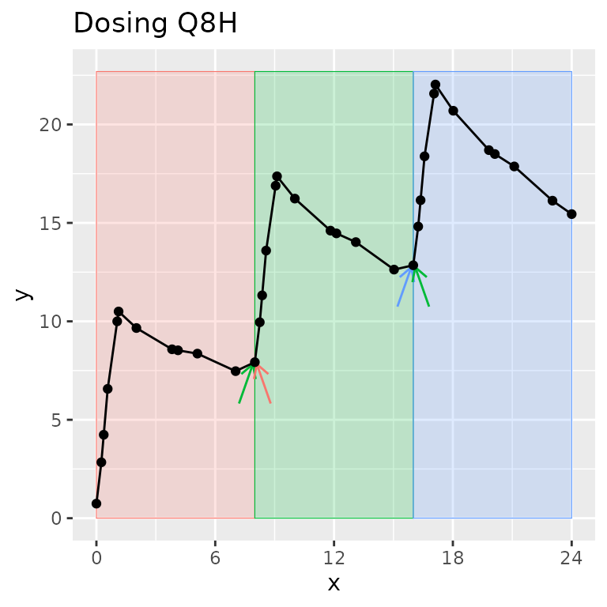
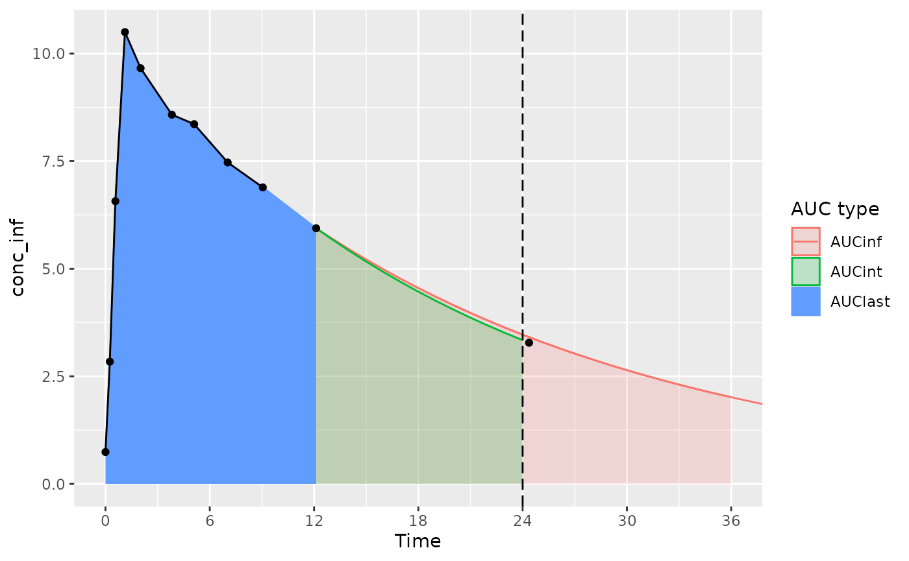

# PKNCA Training Sessions

## Introduction to PKNCA and Basics of Its Use

Creation of these materials were partially supported by funding from the
Metrum Research Group.

### Introduction to PKNCA

PKNCA is a tool for calculating noncompartmental analysis (NCA) results
for pharmacokinetic (PK) data.

… but, you already knew that or you wouldn’t be here.

PKNCA has several foci:

- be regulatory-ready
  - it has approximately 100% test coverage.
- be reproducible
  - it has a focus on being scriptable.
- get the right answer or none at all
  - it will try to know what you want,
  - but all decisions can be overridden, and
  - if there is a question that may cause an error or an unanticipated
    result, either no result will output or an error will be raised.

### Enjoy!

I hope that you have a whale of a good time during this training.


(Foreshadowing…)

### Some NCA Definitions

- **C_(max)**: The maximum observed concentration
- **T_(max)**: The time of the maximum observed concentration
- **t_(last)**: The time of the last concentration above the limit of
  quantification
- **AUC**: Area under the concentration-time curve. Some important AUC
  variants are:
  - **AUC_(last)**: AUC from time zero to t_(last)
  - **AUC_(int)**: AUC from time zero to the end of an interval of time,
    often extrapolated or interpolated (e.g. AUC_(0-24hr))
  - **AUC_(∞)**: AUC from time zero to t_(last) then extrapolated from
    t_(last) to time infinity using the half life

## Dataset Basics

### NCA Data are Not Tidy ***as a Single Dataset***

“Tidy datasets… have a specific structure: each variable is a column,
each observation is a row, and each type of observational unit is a
table.” - Hadley Wickham (<https://doi.org/10.18637/jss.v059.i10>)

CDISC has NCA tidied, and PKNCA follows that model:

- concentration-time is a dataset (PC domain;
  [`PKNCAconc()`](http://humanpred.github.io/pknca/reference/PKNCAconc.md)
  object)
- dose-time is a dataset (EX/EC domains;
  [`PKNCAdose()`](http://humanpred.github.io/pknca/reference/PKNCAdose.md)
  object)
- NCA results are a dataset (PP domain;
  [`pk.nca()`](http://humanpred.github.io/pknca/reference/pk.nca.md)
  output)

### Dataset Basics: Minimum data

PKNCA requires at least the concentration, time, and what you want to
calculate.


### Dataset Basics: What columns are needed?

Column names are provided by the input to
[`PKNCAconc()`](http://humanpred.github.io/pknca/reference/PKNCAconc.md)
and
[`PKNCAdose()`](http://humanpred.github.io/pknca/reference/PKNCAdose.md);
they are not hard-coded.

Columns that can be used include:

- [`PKNCAconc()`](http://humanpred.github.io/pknca/reference/PKNCAconc.md):
  concentration, time, groups; data exclusions; half-life inclusion and
  exclusion
- [`PKNCAdose()`](http://humanpred.github.io/pknca/reference/PKNCAdose.md):
  dose, time, groups; route, rate/duration of infusion; data exclusions
- intervals given to
  [`PKNCAdata()`](http://humanpred.github.io/pknca/reference/PKNCAdata.md):
  groups, start, end, and any NCA parameters to calculate

### Dataset Basics: Example data

In the following slides, abbreviated data from an example study where
two treatments (“A” and “B”) are administered to two subjects (1 and 2).

- For PKNCA, the groups will be **Treatment** and **Subject**.
  - PKNCA considers groups in order with the subject identifier as the
    last group (or the last group before a forward slash, `/`, if `/` is
    present).
  - When indicated in order (`...|Treatment+Subject`), PKNCA
    automatically knows to keep **Treatment** and drop **Subject** for
    summaries (more on that later).

### Dataset Basics: Example concentration data

| Subject | Treatment | Time |  Conc  |
|:-------:|:---------:|:----:|:------:|
|    1    |     A     |  0   |   0    |
|    1    |     A     |  2   | 2.143  |
|    1    |     A     |  8   | 0.4696 |
|    1    |     B     |  0   |   0    |
|    1    |     B     |  2   | 2.179  |
|    1    |     B     |  8   | 0.4852 |

| Subject | Treatment | Time |  Conc  |
|:-------:|:---------:|:----:|:------:|
|    2    |     A     |  0   |   0    |
|    2    |     A     |  2   | 1.937  |
|    2    |     A     |  8   | 0.4929 |
|    2    |     B     |  0   |   0    |
|    2    |     B     |  2   | 2.127  |
|    2    |     B     |  8   | 0.4804 |

### Dataset Basics: Example dosing data

| Subject | Treatment | Time | Dose |
|:-------:|:---------:|:----:|:----:|
|    1    |     A     |  0   |  10  |
|    1    |     B     |  0   |  10  |

| Subject | Treatment | Time | Dose |
|:-------:|:---------:|:----:|:----:|
|    2    |     A     |  0   |  10  |
|    2    |     B     |  0   |  10  |

### Dataset Basics: Example interval data

``` r
d_interval_1 <-
  data.frame(
    start=0, end=8,
    cmax=TRUE, tmax=TRUE, auclast=TRUE
  )
```

| start | end | cmax | tmax | auclast |
|:-----:|:---:|:----:|:----:|:-------:|
|   0   |  8  | TRUE | TRUE |  TRUE   |

Groups are not required, if you want the same intervals calculated for
each group.

### Hands-on: First NCA calculation with PKNCA

``` r
library(dplyr)
library(ggplot2)
library(tidyr)
library(purrr)
library(PKNCA)
# Concentration data setup
d_conc <-
  datasets::Theoph %>%
  filter(Subject %in% 1)
o_conc <- PKNCAconc(conc~Time, data=d_conc)
# Setup intervals for calculation
d_intervals <- data.frame(start=0, end=24, cmax=TRUE, tmax=TRUE,
                          auclast=TRUE, aucint.inf.obs=TRUE)
# Combine concentration and dose
o_data <- PKNCAdata(o_conc, intervals=d_intervals)
# Calculate the results (suppressMessages() hides a message that isn't needed now)
o_result <- suppressMessages(pk.nca(o_data))
# summary(o_result)
```

## PKNCA Functions

### What functions are the most used?

- [`PKNCAconc()`](http://humanpred.github.io/pknca/reference/PKNCAconc.md):
  define a concentration-time `PKNCAconc` object
  - All information about concentration data are given: concentration,
    time
  - Optional information includes: grouping information (usually given),
    data to exclude, half-life inclusion and exclusion columns
- [`PKNCAdose()`](http://humanpred.github.io/pknca/reference/PKNCAdose.md):
  define a dose-time `PKNCAdose` object (optional)
  - dose amount and time are both optional
  - Optional information includes: rate or duration of infusion, data to
    exclude
- [`PKNCAdata()`](http://humanpred.github.io/pknca/reference/PKNCAdata.md):
  combine `PKNCAconc`, optionally `PKNCAdose`, and optionally
  `intervals` into a `PKNCAdata` object
  - the `PKNCAconc` object must be given; the `PKNCAdose` object is
    optional; interval definitions are usually given; calculation
    options may be given
- [`pk.nca()`](http://humanpred.github.io/pknca/reference/pk.nca.md):
  calculate the NCA parameters from a data object into a `PKNCAresult`
  object

### How do I do a simple calculation? all steps

We will break this down in subsequent slides.

``` r
# Concentration data setup
d_conc <-
  datasets::Theoph %>%
  filter(Subject %in% 1)
o_conc <- PKNCAconc(conc~Time, data=d_conc)
# Dose data setup
d_dose <-
  datasets::Theoph %>%
  filter(Subject %in% 1) %>%
  filter(Time == 0)
o_dose <- PKNCAdose(Dose~Time, data=d_dose)
# Combine concentration and dose
o_data <- PKNCAdata(o_conc, o_dose)
# Calculate the results
o_result <- pk.nca(o_data)
```

### How do I do a simple calculation? Concentration data

``` r
# Load your dataset as a data.frame
d_conc <-
  datasets::Theoph %>%
  filter(Subject %in% 1)
# Take a look at the data
pander::pander(head(d_conc, 2))
```

| Subject |  Wt  | Dose | Time | conc |
|:-------:|:----:|:----:|:----:|:----:|
|    1    | 79.6 | 4.02 |  0   | 0.74 |
|    1    | 79.6 | 4.02 | 0.25 | 2.84 |

``` r
# Define the PKNCAconc object indicating the concentration and time columns, the
# dataset, and any other options.
o_conc <- PKNCAconc(conc~Time, data=d_conc)
```

### How do I do a simple calculation? Dose data

``` r
# Load your dataset as a data.frame
d_dose <-
  datasets::Theoph %>%
  filter(Subject %in% 1) %>%
  filter(Time == 0)
# Take a look at the data
pander::pander(d_dose)
```

| Subject |  Wt  | Dose | Time | conc |
|:-------:|:----:|:----:|:----:|:----:|
|    1    | 79.6 | 4.02 |  0   | 0.74 |

``` r
# Define the PKNCAdose object indicating the dose amount and time columns, the
# dataset, and any other options.
o_dose <- PKNCAdose(Dose~Time, data=d_dose)
```

### How do I do a simple calculation? Calculate results

``` r
# Combine the PKNCAconc and PKNCAdose objects.  You can add interval
# specifications and calculation options here.
o_data <- PKNCAdata(o_conc, o_dose)
# Calculate the results
o_result <- pk.nca(o_data)
```

### How do I do a simple calculation? Get results

To calculate summary statistics, use
[`summary()`](https://rdrr.io/r/base/summary.html); to extract all
individual-level results, use
[`as.data.frame()`](https://rdrr.io/r/base/as.data.frame.html).

The `"caption"` attribute of the summary describes how the summary
statistics were calculated for each parameter. (Hint:
[`pander::pander()`](https://rdrr.io/pkg/pander/man/pander.html) knows
how to use that to put the caption on a table in a report.)

The individual results contain the columns for start time, end time,
grouping variables (none in this example), parameter names, values, and
if the value should be excluded.

### How do I do a simple calculation? Get summary results

``` r
# Look at summarized results
pander::pander(summary(o_result))
```

| start | end | auclast | cmax | tmax | half.life | aucinf.obs |
|:-----:|:---:|:-------:|:----:|:----:|:---------:|:----------:|
|   0   | 24  |  92.4   |  .   |  .   |     .     |     .      |
|   0   | Inf |    .    | 10.5 | 1.12 |   14.3    |    215     |

auclast, cmax, aucinf.obs: geometric mean and geometric coefficient of
variation; tmax: median and range; half.life: arithmetic mean and
standard deviation

### How do I do a simple calculation? Get individual results

Use [`as.data.frame()`](https://rdrr.io/r/base/as.data.frame.html) to
get the individual NCA parameter results.

``` r
# Look at individual results
pander::pander(head(
  as.data.frame(o_result),
  n=3
))
```

| start | end | PPTESTCD | PPORRES | exclude |
|:-----:|:---:|:--------:|:-------:|:-------:|
|   0   | 24  | auclast  |  92.37  |   NA    |
|   0   | Inf |   cmax   |  10.5   |   NA    |
|   0   | Inf |   tmax   |  1.12   |   NA    |

## PKNCA datasets

### How does PKNCA think about data?

Three types of data are inputs for calculation in PKNCA:

- concentration-time (`PKNCAconc`),
- dose-time (`PKNCAdose`), and
- intervals.

`PKNCAconc` and `PKNCAdose` objects can optionally have groups. The
groups in a `PKNCAdose` object must be the same or fewer than the groups
in `PKNCAconc` object (for example, all subjects in a treatment arm may
receive the same dose).

### What is an “interval” and how is it different than a “group”?

A **group** separates one full concentration-time profile for a subject
that you may ever want to consider at the same time. Usually, it groups
by study, treatment, analyte, and subject (other groups can be useful
depending on the study design).

An **interval** selects a time range within a **group**.

One time can be in zero or more intervals, but only zero or one group.
Intervals can be adjacent (0-12 and 12-24) or overlap (0-12 and 0-24).
In other words, one sample may be used in more than one interval, but
one sample will never be used in more than one group.

**Legend:** The group contains all points on the figure. Shaded regions
indicate intervals. Arrows indicate points shared between intervals
within the group.



### Common data management requirements before sending data to PKNCA

1.  Time must not be missing for `PKNCAconc` (if given to `PKNCAdose`,
    it must not be missing).
2.  Below the limit of quantification (BLQ) concentrations must be set
    to zero (not `NA`).
3.  Imputation of time zero is required for AUC calculation.
4.  Especially for actual-time calculations, imputation of the beginning
    of the interval is usually needed.

Columns must be created for:

- Concentration or dose,
- Time
- Groups
  - usually columns for study, treatment arm, subject;
  - sometimes analyte, formulation, period (needed in case the same
    subject receives the same treatment arm multiple times)

### Setup your concentration data

- Concentration data must be numeric

A

### Setup your concentration data

- Concentration data must be numeric
- Time must be numeric and not be missing

NA

### Setup your concentration data

- Concentration data must be numeric
- Time must be numeric and not be missing
- Groups can be anything, setup at the level of the individual

  
Group: 🗸 a pod of killer whales

### Setup your dosing data (if you have it and even if you don’t)

Normal dosing data setup:
`PKNCAdose(dose~time|actarm+usubjid, data=d_dose)`

- Dose amount must be numeric — or it can be omitted
  - `PKNCAdose(~time|actarm+usubjid, data=d_dose)`
- Time must be numeric and not be missing — or it can be omitted
  - `PKNCAdose(dose~.|actarm+usubjid, data=d_dose)`
- Groups can be anything — may be grouped at a higher level than the
  individual
  - Useful when all dose amounts and times are the same within an arm:
    `PKNCAdose(dose~time|actarm, data=d_dose)`
  - Useful dose amount is the same at all times within an arm:
    `PKNCAdose(dose~.|actarm, data=d_dose)`
  - Useful when times are all the same within an arm but dose may
    differ: `PKNCAdose(~time|actarm, data=d_dose)`

### Define your intervals

Intervals have columns for:

- `start` and `end` times for the interval,
- groups matching any level of grouping; intervals apply by a merge/join
  with the groups
- parameters to calculate (`TRUE` means to calculate it; `FALSE` means
  don’t). The full list of available parameters is in the [selection of
  calculation intervals
  vignette](http://humanpred.github.io/pknca/articles/Selection-of-Calculation-Intervals.html#parameters-available-for-calculation-in-an-interval-1).
  - You only have to specify the parameter you want, not all parameters.

### Define your intervals: example

- For time 0 to 24, calculate AUClast
- For time 0 to infinity, calculate cmax, tmax, half.life, and
  aucinf.obs

| start | end | auclast | cmax  | tmax  | half.life | aucinf.obs |
|:-----:|:---:|:-------:|:-----:|:-----:|:---------:|:----------:|
|   0   | 24  |  TRUE   | FALSE | FALSE |   FALSE   |   FALSE    |
|   0   | Inf |  FALSE  | TRUE  | TRUE  |   TRUE    |    TRUE    |

## Calculations above the hood

### Prepare your data for calculation

``` r
d_conc <-
  datasets::Theoph %>%
  mutate(
    Treatment=
      case_when(
        Dose <= median(Dose)~"Low dose",
        TRUE~"High dose"
      )
  )
# The study was single-dose
d_dose <-
  d_conc %>%
  select(Treatment, Subject, Dose) %>%
  unique() %>%
  mutate(dose_time=0)
```

### Calculate without dosing data

``` r
o_conc <- PKNCAconc(conc~Time|Treatment+Subject, data=d_conc)
try({
  o_data <- PKNCAdata(o_conc)
  summary(pk.nca(o_data))
})
```

    ## Error in PKNCAdata.default(data.conc = data.conc, data.dose = data.dose,  : 
    ##   If data.dose is not given, intervals must be given

Whoops! Without dosing, we need intervals.

### Calculate without dosing data, try 2

``` r
o_conc <- PKNCAconc(conc~Time|Treatment+Subject, data=d_conc)
d_intervals <- data.frame(start=0, end=Inf, cmax=TRUE, tmax=TRUE,
                          half.life=TRUE, aucinf.obs=TRUE)
o_data_manual_intervals <- PKNCAdata(o_conc, intervals=d_intervals)
summary(pk.nca(o_data_manual_intervals))
```

    ## No dose information provided, calculations requiring dose will return NA.

    ##  start end Treatment N        cmax               tmax   half.life aucinf.obs
    ##      0 Inf High dose 5 9.16 [19.4] 3.48 [0.980, 3.55] 7.73 [1.08] 120 [26.2]
    ##      0 Inf  Low dose 7 8.30 [15.2] 1.12 [0.630, 2.02] 8.50 [2.67] 111 [31.6]
    ## 
    ## Caption: cmax, aucinf.obs: geometric mean and geometric coefficient of variation; tmax: median and range; half.life: arithmetic mean and standard deviation; N: number of subjects

### Dosing data helps with interval setup

``` r
o_conc <- PKNCAconc(conc~Time|Treatment+Subject, data=d_conc)
o_dose <- PKNCAdose(Dose~dose_time|Treatment+Subject, data=d_dose)
o_data_auto_intervals <- PKNCAdata(o_conc, o_dose)
o_data_auto_intervals$intervals$aucint.inf.obs <- TRUE
summary(pk.nca(o_data_auto_intervals))
```

    ##  start end Treatment N     auclast        cmax               tmax   half.life
    ##      0  24  Low dose 7 70.2 [14.4]           .                  .           .
    ##      0 Inf  Low dose 7           . 8.30 [15.2] 1.12 [0.630, 2.02] 8.50 [2.67]
    ##      0  24 High dose 5 81.3 [34.2]           .                  .           .
    ##      0 Inf High dose 5           . 9.16 [19.4] 3.48 [0.980, 3.55] 7.73 [1.08]
    ##  aucinf.obs aucint.inf.obs
    ##           .    94.1 [22.5]
    ##  111 [31.6]     111 [31.6]
    ##           .     105 [23.3]
    ##  120 [26.2]     120 [26.2]
    ## 
    ## Caption: auclast, cmax, aucinf.obs, aucint.inf.obs: geometric mean and geometric coefficient of variation; tmax: median and range; half.life: arithmetic mean and standard deviation; N: number of subjects

### AUC considerations with PKNCA (1/3)


The considerations below mainly apply to actual-time data; nominal-time
data usually have measurements at the start and end time for the
interval.

With an interval start and end of 0 and 24 (and the last measurement
time just after 24 hours):

- **AUC_(last)** is calculated only based on points within the interval
  (the AUClast color in the figure)

### AUC considerations with PKNCA (2/3)



The considerations below mainly apply to actual-time data; nominal-time
data usually have measurements at the start and end time for the
interval.

With an interval start and end of 0 and 24 (and the last measurement
time just after 24 hours):

- **AUC_(int)** looks at the points in the interval, and if there is no
  measurement at the interval end time, interpolates or extrapolates to
  the interval end time (the AUClast and AUCint color in the figure)

### AUC considerations with PKNCA (3/3)


The considerations below mainly apply to actual-time data; nominal-time
data usually have measurements at the start and end time for the
interval.

With an interval start and end of 0 and 24 (and the last measurement
time just after 24 hours):

- **AUC_(∞)** is calculated based on AUC_(last), t_(last), and the
  half-life from t_(last), only using data within the interval– no data
  after the end of the interval.
- Ensure that the interval used for calculating AUC_(∞) includes all the
  points desired (usually, `end=Inf`).

## Hands-on workshop

### Steady-state intramuscular administration

The data for the exercise are from a PK study of amikacin in a killer
whale and a beluga whale. (DOI: 10.1638/03-078)


(Callback…)

### Steady-state intramuscular administration

``` r
library(PKNCA)
# Data available from https://github.com/humanpred/pknca/tree/main/data-raw/whale
d_conc <- read.csv("c:/tmp/whale_conc.csv")
d_dose <- read.csv("c:/tmp/whale_dose.csv")
head(d_conc)
head(d_dose)

o_conc <- PKNCAconc(concentration~time|Animal, data=d_conc)
o_dose <- PKNCAdose(dose~time|Animal, data=d_dose)
o_data <- PKNCAdata(o_conc, o_dose)
o_data$intervals
o_nca <- pk.nca(o_data)
summary(o_nca)
summary(o_nca, drop.group=c())
as.data.frame(o_nca)
```

## Day 2 Start

## Control your data

### Including and excluding data points

Data may be included/excluded in two ways:

- Overall: excluded a row of data from all analyses
- Half-life: excluded from half-life calculations, but included in all
  other analyses

For both ways of including/excluding data, it is defined by a column in
the input data. The column is either `NA` or an empty string (`""`) to
indicate “no” or any other text to indicate “yes”.

### Exclude data points overall

Use the `exclude` argument for
[`PKNCAconc()`](http://humanpred.github.io/pknca/reference/PKNCAconc.md)
or
[`PKNCAdose()`](http://humanpred.github.io/pknca/reference/PKNCAdose.md).

When you use `exclude`, this is how you give your data to PKNCA:

``` r
d_before_exclude <-
 data.frame(
  time=0:4,
  conc=c(0, 2, 1, 0.5, 0.25),
  not_this=c(NA, "Not this", rep(NA, 3))
 )
o_conc <-
 PKNCAconc(
  data=d_before_exclude,
  conc~time,
  exclude="not_this"
 )
```

And, this is how PKNCA thinks about it:

``` r
pander::pander(
  d_before_exclude %>%
    filter(is.na(not_this))
)
```

| time | conc | not_this |
|:----:|:----:|:--------:|
|  0   |  0   |    NA    |
|  2   |  1   |    NA    |
|  3   | 0.5  |    NA    |
|  4   | 0.25 |    NA    |

### Exclude data points overall

``` r
o_conc <- PKNCAconc(data=d_before_exclude, conc~time, exclude="not_this")
```

Hey babe, did you get my 5 rows of data?

I only saw 4 rows. Are you sure you sent 5?

Yep, definitely 5 check that last slide. 😠

…

New phone. Who dis?

### Digression: How is λz automatically calculated?

- Filter the data from the first point after t_(max) (or from t_(max) if
  `allow.tmax.in.half.life=TRUE`) to t_(last) and excluding BLQ in the
  middle.
- Fit the semi-log line from 3 points before t_(last) (3 can be changed
  with the `min.hl.points` option) to t_(last).
  - Repeat for all sets of points from there to the first point
    included.
  - If that 3 points are not available, it is not calculated.
- Among the fits, select the best adjusted r² (within a tolerance of
  `adj.r.squared.factor`).
- Require λz`> 0`.
- If more than one fit is available at this point, select the one with
  the most points included.

Note: WinNonlin first requires λz`> 0` then selects for adjusted r².
Therefore, WinNonlin will occasionally provide a half-life when PKNCA
will not, but the fit line is not as good (as measured by r²). The
selection of filtering order is an intentional feature with PKNCA, and
it generally has minimal impact on summary statistics because the
quality of the half-life fit is usually low in this scenario.

### λz control (manual exclusions and inclusions of data points)

Use the `exclude_half.life` or `include_half.life` argument for
[`PKNCAconc()`](http://humanpred.github.io/pknca/reference/PKNCAconc.md).
The two arguments behave very differently in how points are selected for
half-life.

`exclude_half.life` uses the same automatic point selection method of
curve stripping (described before), but it excludes individual points
from that calculation.

`include_half.life` uses no automatic point selection method, and only
points specifically noted by the analyst are included.

## Less-common calculations

### Urine calculations

``` r
d_urine <-
  data.frame(
    conc=c(1, 2, 3),
    urine_volume=c(200, 100, 300),
    time=c(1, 2, 3)
  )
o_conc <- PKNCAconc(data=d_urine, conc~time, volume="urine_volume")
d_intervals <- data.frame(start=0, end=24, ae=TRUE)
o_data <- PKNCAdata(o_conc, intervals=d_intervals)
o_nca <- suppressMessages(pk.nca(o_data))
summary(o_nca)
```

    ##  start end   ae
    ##      0  24 1300
    ## 
    ## Caption: ae: geometric mean and geometric coefficient of variation

### Urine calculations: understanding what is happening and potential hiccups

Intervals for urine are treated the same as any other interval type.
Specifically, PKNCA does not look outside the start and end of the
interval.

- Watch out for e.g. a 24-hour urine amount to be included in more than
  one interval because start = 0 and end = 24.
- Watch out for an actual start or end time to be outside of the
  interval and therefore to be omitted from calculations.

## Calculations below the hood

### PKNCA only calculates what is required, not every possible parameter (1 of 2)

If you don’t need a parameter, PKNCA won’t calculate it.

For example, if all you need is `cmax`, all you’ll get is `cmax`.

``` r
o_conc <- PKNCAconc(data=data.frame(conc=2^-(1:4), time=0:3), conc~time)
o_data <- PKNCAdata(o_conc, intervals=data.frame(start=0, end=Inf, cmax=TRUE))
o_nca <- suppressMessages(pk.nca(o_data))
as.data.frame(o_nca)
```

    ## # A tibble: 1 × 5
    ##   start   end PPTESTCD PPORRES exclude
    ##   <dbl> <dbl> <chr>      <dbl> <chr>  
    ## 1     0   Inf cmax         0.5 NA

### PKNCA only calculates what is required, not every possible parameter (2 of 2)

If you need AUC₀₋, PKNCA will calculate other required parameters behind
the scenes.

``` r
o_data <-
  PKNCAdata(
    o_conc,
    intervals=
      data.frame(
        start=0, end=Inf,
        aucinf.obs=TRUE
      )
  )
o_nca <- suppressMessages(pk.nca(o_data))
```

``` r
as.data.frame(o_nca)
```

    ## # A tibble: 14 × 5
    ##    start   end PPTESTCD            PPORRES exclude
    ##    <dbl> <dbl> <chr>                 <dbl> <chr>  
    ##  1     0   Inf tmax                 0      NA     
    ##  2     0   Inf tlast                3      NA     
    ##  3     0   Inf clast.obs            0.0625 NA     
    ##  4     0   Inf lambda.z             0.693  NA     
    ##  5     0   Inf r.squared            1      NA     
    ##  6     0   Inf adj.r.squared        1      NA     
    ##  7     0   Inf lambda.z.corrxy     -1      NA     
    ##  8     0   Inf lambda.z.time.first  1      NA     
    ##  9     0   Inf lambda.z.time.last   3      NA     
    ## 10     0   Inf lambda.z.n.points    3      NA     
    ## 11     0   Inf clast.pred           0.0625 NA     
    ## 12     0   Inf half.life            1      NA     
    ## 13     0   Inf span.ratio           2      NA     
    ## 14     0   Inf aucinf.obs           0.721  NA

### How to select the correct parameters for calculations (aka, why are there 32 types of AUC in PKNCA?)

CDISC has one set of names, but they are not precise (e.g. AUCINT
doesn’t tell the interpolation/extrapolation method).

PKNCA tries to be everything to everyone (in terms of parameters
calculated), and it simultaneously tries to be precise. That yields many
parameters.

See the Selection of Calculation Intervals vignette in the [Parameters
Available for Calculation in an Interval
section](http://humanpred.github.io/pknca/articles/Selection-of-Calculation-Intervals.html#parameters-available-for-calculation-in-an-interval-1)
for all available parameters.

### When are intervals (partly) ignored?

Very few parameters reach outside of the `start` and `end` of an
interval for additional information about what is being calculated. As
of the writing of these training materials (PKNCA version 0.9.5), the
only parameters that look outside are the `aucint` class of parameters.

AUC_(int) may look after the end of the interval to calculate the
concentration at `end`.

Note: Watch out for a dose before the next concentration (e.g. a dose at
24 hours but the prior sample is around 12 and the next is around 25):


## Control your results

### Excluding results (Not the best way)

A simple way to exclude a value from results is to convert the results
to a data.frame and then drop the rows you don’t want:

``` r
as.data.frame(o_nca) %>%
  filter(PPTESTCD != "half.life")
```

    ## # A tibble: 13 × 5
    ##    start   end PPTESTCD            PPORRES exclude
    ##    <dbl> <dbl> <chr>                 <dbl> <chr>  
    ##  1     0   Inf tmax                 0      NA     
    ##  2     0   Inf tlast                3      NA     
    ##  3     0   Inf clast.obs            0.0625 NA     
    ##  4     0   Inf lambda.z             0.693  NA     
    ##  5     0   Inf r.squared            1      NA     
    ##  6     0   Inf adj.r.squared        1      NA     
    ##  7     0   Inf lambda.z.corrxy     -1      NA     
    ##  8     0   Inf lambda.z.time.first  1      NA     
    ##  9     0   Inf lambda.z.time.last   3      NA     
    ## 10     0   Inf lambda.z.n.points    3      NA     
    ## 11     0   Inf clast.pred           0.0625 NA     
    ## 12     0   Inf span.ratio           2      NA     
    ## 13     0   Inf aucinf.obs           0.721  NA

But, parameters derived from half-life remain.

### Excluding results (The best way, 1/2)

When you use the
[`exclude()`](http://humanpred.github.io/pknca/reference/exclude.md)
function, parameters that are dependent on an excluded parameter will be
excluded.

``` r
o_nca_excluded <-
  o_nca %>%
  exclude(FUN=exclude_nca_span.ratio(3))
```

    ## Loading required namespace: testthat

``` r
as.data.frame(o_nca_excluded)
```

    ## # A tibble: 14 × 5
    ##    start   end PPTESTCD            PPORRES exclude       
    ##    <dbl> <dbl> <chr>                 <dbl> <chr>         
    ##  1     0   Inf tmax                 0      NA            
    ##  2     0   Inf tlast                3      NA            
    ##  3     0   Inf clast.obs            0.0625 NA            
    ##  4     0   Inf lambda.z             0.693  span.ratio < 3
    ##  5     0   Inf r.squared            1      span.ratio < 3
    ##  6     0   Inf adj.r.squared        1      span.ratio < 3
    ##  7     0   Inf lambda.z.corrxy     -1      span.ratio < 3
    ##  8     0   Inf lambda.z.time.first  1      span.ratio < 3
    ##  9     0   Inf lambda.z.time.last   3      span.ratio < 3
    ## 10     0   Inf lambda.z.n.points    3      span.ratio < 3
    ## 11     0   Inf clast.pred           0.0625 span.ratio < 3
    ## 12     0   Inf half.life            1      span.ratio < 3
    ## 13     0   Inf span.ratio           2      span.ratio < 3
    ## 14     0   Inf aucinf.obs           0.721  span.ratio < 3

### Excluding results (The best way, 2/2)

Now, everything dependent on the half-life is excluded in summaries.

``` r
summary(o_nca)
```

    ##  start end aucinf.obs
    ##      0 Inf      0.721
    ## 
    ## Caption: aucinf.obs: geometric mean and geometric coefficient of variation

``` r
summary(o_nca_excluded)
```

    ##  start end aucinf.obs
    ##      0 Inf         NC
    ## 
    ## Caption: aucinf.obs: geometric mean and geometric coefficient of variation

## NCA-related calculations

### Superposition

Superposition assumes linear kinetics and can convert a single-dose
profile to multi-dose.

``` r
# Subject 2 is selected for a BLQ time=0 concentration
d_prep <-
  datasets::Theoph %>%
  filter(Subject == 2)
# Superposition to steady-state is the default
d_ss <-
  superposition(
    conc=d_prep$conc,
    time=d_prep$Time,
    tau=24
  )
# Going to steady-state is also an option
# (n.tau=2 means the second dose)
d_second_dose <-
  superposition(
    conc=d_prep$conc,
    time=d_prep$Time,
    tau=24,
    n.tau=2
  )
```

``` r
# Want the profile for the first two doses
# together?
d_first_two <-
  superposition(
    conc=d_prep$conc,
    time=d_prep$Time,
    tau=48, # 48 hours
    n.tau=1, # One tau interval (0 to 48 hours)
    dose.times=c(0, 24)
  )
```


### Time-to-Steady-state calculations

Time-to-steady-state (tss) can be useful as a method to confirm that a
subject is at steady-state. PKNCA can calculate tss using trough
concentrations either with a monoexponential increase toward
steady-state (preferred) or a linear trend back from the final point.

``` r
dose_times <- seq(0, 96-1, by=6)
d_multidose <-
  superposition(
    conc=d_prep$conc,
    time=d_prep$Time,
    tau=96, # 48 hours
    n.tau=1, # One tau interval (0 to 48 hours)
    dose.times=dose_times
  )
pk.tss.monoexponential(
  conc=d_multidose$conc, time=d_multidose$time, subject=rep(1, nrow(d_multidose)),
  time.dosing=dose_times, subject.dosing=rep(1, length(dose_times)),
  output="single"
)
```

    ##   tss.monoexponential.single
    ## 1                   22.53005

## Reporting

### Graphics are intentionally not part of PKNCA, but there are some tricks that can help…

Generate all individual profiles using the groups that you defined:

``` r
o_conc <- PKNCAconc(conc~Time|Subject, data=datasets::Theoph)
d_plot <-
  grouped_df(data=datasets::Theoph, vars=names(getGroups(o_conc))) %>%
  nest() %>%
  mutate(
    figure=
      lapply(
        pmap(.l=list(data=data), .f=ggplot,aes(x=Time, y=conc)),
        FUN="+",
        geom_line()
      )
  )
# d_plot$figure
```

### Best practices for Data -\> PKNCA -\> knitr

Make summary tables using the
[`summary()`](https://rdrr.io/r/base/summary.html) function on the NCA
results, and use
[`pander::pander()`](https://rdrr.io/pkg/pander/man/pander.html) to make
a pretty table with captions.

``` r
pander::pander(summary(o_nca))
```

| start | end | aucinf.obs |
|:-----:|:---:|:----------:|
|   0   | Inf |   0.721    |

aucinf.obs: geometric mean and geometric coefficient of variation

Make an NCA data listing using the
[`as.data.frame()`](https://rdrr.io/r/base/as.data.frame.html) function
on the NCA results.

``` r
pander::pander(as.data.frame(o_nca))
```

### Units (especially clearance)

PKNCA supports units with the
[`pknca_units_table()`](http://humanpred.github.io/pknca/reference/pknca_units_table.md)
function. See the [Unit Assignment and Conversion with
PKNCA](http://humanpred.github.io/pknca/articles/v07-unit-conversion.md)
vignette for more information.

When units are not specified, The most common place where that becomes
an issue is with clearance which ends up having unusual units like
“mg/(hr\*ng/mL)” (with units of mg for dosing, hr for time, and ng/mL
for concentration).

### Data imputation

Some data points are required for inputs such as:

- the start of the interval for AUC,
- the end of the interval for some calculations (e.g. AUC_(last) vs
  AUC_(int)), and
- interpolated concentrations at the end of a urine interval for urinary
  PK calculations.

### IV bolus AUC (need to add C0)

Due to the need for back-extrapolation to C₀, AUCs for IV bolus dosing
need to use different AUC parameters such as `"aucivlast"` instead of
`"auclast"`.

### Combined, multi-subject data (e.g. sparse animal sampling)

Sparse NCA calculations are supported in PKNCA. See the [Sparse NCA
Calculations](http://humanpred.github.io/pknca/articles/v04-sparse.md)
vignette for more information.

## Limitations

### Secondary parameters (e.g. bioavailability and renal clearance)

PKNCA does not (yet) have the ability to calculate secondary PK
parameters that require looking at more than one group/interval at a
time.

### Validation of PKNCA

PKNCA has an extensive testing and validation suite built-in. To run the
testing and validation suite of tests with a full report generated, see
the [PKNCA
Validation](http://humanpred.github.io/pknca/articles/v60-PKNCA-validation.md)
vignette.

## Hands-on

### Single- and Multiple-dose, single analyte: Setup the underlying datasets

``` r
d_conc <-
  datasets::Theoph %>%
  rename(time=Time) %>%
  mutate(
    Subject=as.character(Subject)
  )
d_multidose <-
  PKNCAconc(conc~time|Subject, data=d_conc) %>%
  superposition(tau=24, check.blq=FALSE)
d_singledose_single_analyte <-
  d_conc %>%
  mutate(
    Study_Part="Single"
  )
d_multidose_single_analyte <-
  d_conc %>%
  mutate(Day=1) %>%
  bind_rows(
    d_multidose %>% mutate(time=time + 120, Day=6)
  ) %>%
  mutate(
    Study_Part="Multiple"
  )
```

### Single- and Multiple-dose, single analyte: Setup the concentration and dose datasets

``` r
d_single_multi_conc <- bind_rows(d_singledose_single_analyte, d_multidose_single_analyte)
d_single_multi_dose <-
  d_single_multi_conc %>%
  filter(
    (Study_Part %in% "Single" & time == 0) |
      (Study_Part %in% "Multiple" & (time %% 24) == 0)
  )
```

### Single- and Multiple-dose, single analyte: Perform basic analysis

``` r
o_conc <- PKNCAconc(data=d_single_multi_conc, conc~time|Study_Part+Subject)
o_dose <- PKNCAdose(data=d_single_multi_dose, Dose~time|Study_Part+Subject)
o_data <- PKNCAdata(o_conc, o_dose)
o_data$intervals %>% select(-Subject) %>% unique() %>% as.data.frame()
```

    ##   start end auclast aucall aumclast aumcall aucint.last aucint.last.dose
    ## 1     0  24    TRUE  FALSE    FALSE   FALSE       FALSE            FALSE
    ## 2     0 Inf   FALSE  FALSE    FALSE   FALSE       FALSE            FALSE
    ## 3     0 120    TRUE  FALSE    FALSE   FALSE       FALSE            FALSE
    ## 4   120 144    TRUE  FALSE    FALSE   FALSE       FALSE            FALSE
    ##   aucint.all aucint.all.dose    c0  cmax  cmin  tmax tlast tfirst clast.obs
    ## 1      FALSE           FALSE FALSE FALSE FALSE FALSE FALSE  FALSE     FALSE
    ## 2      FALSE           FALSE FALSE  TRUE FALSE  TRUE FALSE  FALSE     FALSE
    ## 3      FALSE           FALSE FALSE  TRUE FALSE  TRUE FALSE  FALSE     FALSE
    ## 4      FALSE           FALSE FALSE  TRUE FALSE  TRUE FALSE  FALSE     FALSE
    ##   cl.last cl.all     f mrt.last mrt.iv.last vss.last vss.iv.last   cav
    ## 1   FALSE  FALSE FALSE    FALSE       FALSE    FALSE       FALSE FALSE
    ## 2   FALSE  FALSE FALSE    FALSE       FALSE    FALSE       FALSE FALSE
    ## 3   FALSE  FALSE FALSE    FALSE       FALSE    FALSE       FALSE FALSE
    ## 4   FALSE  FALSE FALSE    FALSE       FALSE    FALSE       FALSE FALSE
    ##   cav.int.last cav.int.all ctrough cstart   ptr  tlag deg.fluc swing  ceoi
    ## 1        FALSE       FALSE   FALSE  FALSE FALSE FALSE    FALSE FALSE FALSE
    ## 2        FALSE       FALSE   FALSE  FALSE FALSE FALSE    FALSE FALSE FALSE
    ## 3        FALSE       FALSE   FALSE  FALSE FALSE FALSE    FALSE FALSE FALSE
    ## 4        FALSE       FALSE   FALSE  FALSE FALSE FALSE    FALSE FALSE FALSE
    ##   aucabove.predose.all aucabove.trough.all count_conc count_conc_measured
    ## 1                FALSE               FALSE      FALSE               FALSE
    ## 2                FALSE               FALSE      FALSE               FALSE
    ## 3                FALSE               FALSE      FALSE               FALSE
    ## 4                FALSE               FALSE      FALSE               FALSE
    ##   totdose volpk    ae clr.last clr.obs clr.pred    fe sparse_auclast
    ## 1   FALSE FALSE FALSE    FALSE   FALSE    FALSE FALSE          FALSE
    ## 2   FALSE FALSE FALSE    FALSE   FALSE    FALSE FALSE          FALSE
    ## 3   FALSE FALSE FALSE    FALSE   FALSE    FALSE FALSE          FALSE
    ## 4   FALSE FALSE FALSE    FALSE   FALSE    FALSE FALSE          FALSE
    ##   sparse_auc_se sparse_auc_df time_above aucivlast aucivall aucivint.last
    ## 1         FALSE         FALSE      FALSE     FALSE    FALSE         FALSE
    ## 2         FALSE         FALSE      FALSE     FALSE    FALSE         FALSE
    ## 3         FALSE         FALSE      FALSE     FALSE    FALSE         FALSE
    ## 4         FALSE         FALSE      FALSE     FALSE    FALSE         FALSE
    ##   aucivint.all aucivpbextlast aucivpbextall aucivpbextint.last
    ## 1        FALSE          FALSE         FALSE              FALSE
    ## 2        FALSE          FALSE         FALSE              FALSE
    ## 3        FALSE          FALSE         FALSE              FALSE
    ## 4        FALSE          FALSE         FALSE              FALSE
    ##   aucivpbextint.all half.life r.squared adj.r.squared lambda.z.corrxy lambda.z
    ## 1             FALSE     FALSE     FALSE         FALSE           FALSE    FALSE
    ## 2             FALSE      TRUE     FALSE         FALSE           FALSE    FALSE
    ## 3             FALSE     FALSE     FALSE         FALSE           FALSE    FALSE
    ## 4             FALSE     FALSE     FALSE         FALSE           FALSE    FALSE
    ##   lambda.z.time.first lambda.z.time.last lambda.z.n.points clast.pred
    ## 1               FALSE              FALSE             FALSE      FALSE
    ## 2               FALSE              FALSE             FALSE      FALSE
    ## 3               FALSE              FALSE             FALSE      FALSE
    ## 4               FALSE              FALSE             FALSE      FALSE
    ##   span.ratio thalf.eff.last thalf.eff.iv.last kel.last kel.iv.last aucinf.obs
    ## 1      FALSE          FALSE             FALSE    FALSE       FALSE      FALSE
    ## 2      FALSE          FALSE             FALSE    FALSE       FALSE       TRUE
    ## 3      FALSE          FALSE             FALSE    FALSE       FALSE      FALSE
    ## 4      FALSE          FALSE             FALSE    FALSE       FALSE      FALSE
    ##   aucinf.pred aumcinf.obs aumcinf.pred aucint.inf.obs aucint.inf.obs.dose
    ## 1       FALSE       FALSE        FALSE          FALSE               FALSE
    ## 2       FALSE       FALSE        FALSE          FALSE               FALSE
    ## 3       FALSE       FALSE        FALSE          FALSE               FALSE
    ## 4       FALSE       FALSE        FALSE          FALSE               FALSE
    ##   aucint.inf.pred aucint.inf.pred.dose aucivinf.obs aucivinf.pred
    ## 1           FALSE                FALSE        FALSE         FALSE
    ## 2           FALSE                FALSE        FALSE         FALSE
    ## 3           FALSE                FALSE        FALSE         FALSE
    ## 4           FALSE                FALSE        FALSE         FALSE
    ##   aucivpbextinf.obs aucivpbextinf.pred aucpext.obs aucpext.pred cl.obs cl.pred
    ## 1             FALSE              FALSE       FALSE        FALSE  FALSE   FALSE
    ## 2             FALSE              FALSE       FALSE        FALSE  FALSE   FALSE
    ## 3             FALSE              FALSE       FALSE        FALSE  FALSE   FALSE
    ## 4             FALSE              FALSE       FALSE        FALSE  FALSE   FALSE
    ##   mrt.obs mrt.pred mrt.iv.obs mrt.iv.pred mrt.md.obs mrt.md.pred vz.obs vz.pred
    ## 1   FALSE    FALSE      FALSE       FALSE      FALSE       FALSE  FALSE   FALSE
    ## 2   FALSE    FALSE      FALSE       FALSE      FALSE       FALSE  FALSE   FALSE
    ## 3   FALSE    FALSE      FALSE       FALSE      FALSE       FALSE  FALSE   FALSE
    ## 4   FALSE    FALSE      FALSE       FALSE      FALSE       FALSE  FALSE   FALSE
    ##   vss.obs vss.pred vss.iv.obs vss.iv.pred vss.md.obs vss.md.pred
    ## 1   FALSE    FALSE      FALSE       FALSE      FALSE       FALSE
    ## 2   FALSE    FALSE      FALSE       FALSE      FALSE       FALSE
    ## 3   FALSE    FALSE      FALSE       FALSE      FALSE       FALSE
    ## 4   FALSE    FALSE      FALSE       FALSE      FALSE       FALSE
    ##   cav.int.inf.obs cav.int.inf.pred thalf.eff.obs thalf.eff.pred
    ## 1           FALSE            FALSE         FALSE          FALSE
    ## 2           FALSE            FALSE         FALSE          FALSE
    ## 3           FALSE            FALSE         FALSE          FALSE
    ## 4           FALSE            FALSE         FALSE          FALSE
    ##   thalf.eff.iv.obs thalf.eff.iv.pred kel.obs kel.pred kel.iv.obs kel.iv.pred
    ## 1            FALSE             FALSE   FALSE    FALSE      FALSE       FALSE
    ## 2            FALSE             FALSE   FALSE    FALSE      FALSE       FALSE
    ## 3            FALSE             FALSE   FALSE    FALSE      FALSE       FALSE
    ## 4            FALSE             FALSE   FALSE    FALSE      FALSE       FALSE
    ##   auclast.dn aucall.dn aucinf.obs.dn aucinf.pred.dn aumclast.dn aumcall.dn
    ## 1      FALSE     FALSE         FALSE          FALSE       FALSE      FALSE
    ## 2      FALSE     FALSE         FALSE          FALSE       FALSE      FALSE
    ## 3      FALSE     FALSE         FALSE          FALSE       FALSE      FALSE
    ## 4      FALSE     FALSE         FALSE          FALSE       FALSE      FALSE
    ##   aumcinf.obs.dn aumcinf.pred.dn cmax.dn cmin.dn clast.obs.dn clast.pred.dn
    ## 1          FALSE           FALSE   FALSE   FALSE        FALSE         FALSE
    ## 2          FALSE           FALSE   FALSE   FALSE        FALSE         FALSE
    ## 3          FALSE           FALSE   FALSE   FALSE        FALSE         FALSE
    ## 4          FALSE           FALSE   FALSE   FALSE        FALSE         FALSE
    ##   cav.dn ctrough.dn clr.last.dn clr.obs.dn clr.pred.dn Study_Part
    ## 1  FALSE      FALSE       FALSE      FALSE       FALSE     Single
    ## 2  FALSE      FALSE       FALSE      FALSE       FALSE     Single
    ## 3  FALSE      FALSE       FALSE      FALSE       FALSE   Multiple
    ## 4  FALSE      FALSE       FALSE      FALSE       FALSE   Multiple

``` r
o_nca <- pk.nca(o_data)
```

### Single- and Multiple-dose, single analyte: Use intervals for fewer subjects

``` r
d_intervals <-
  data.frame(
    start=0,
    end=24,
    Subject=c("1", "2"),
    Study_Part="Single",
    aucinf.obs=TRUE
  )
o_data <- PKNCAdata(o_conc, o_dose, intervals=d_intervals)
o_nca <- pk.nca(o_data)
```

    ## Warning: Study_Part=Single; Subject=3: No intervals for data

    ## Warning: Study_Part=Single; Subject=4: No intervals for data

    ## Warning: Study_Part=Single; Subject=5: No intervals for data

    ## Warning: Study_Part=Single; Subject=6: No intervals for data

    ## Warning: Study_Part=Single; Subject=7: No intervals for data

    ## Warning: Study_Part=Single; Subject=8: No intervals for data

    ## Warning: Study_Part=Single; Subject=9: No intervals for data

    ## Warning: Study_Part=Single; Subject=10: No intervals for data

    ## Warning: Study_Part=Single; Subject=11: No intervals for data

    ## Warning: Study_Part=Single; Subject=12: No intervals for data

    ## Warning: Study_Part=Multiple; Subject=1: No intervals for data

    ## Warning: Study_Part=Multiple; Subject=2: No intervals for data

    ## Warning: Study_Part=Multiple; Subject=3: No intervals for data

    ## Warning: Study_Part=Multiple; Subject=4: No intervals for data

    ## Warning: Study_Part=Multiple; Subject=5: No intervals for data

    ## Warning: Study_Part=Multiple; Subject=6: No intervals for data

    ## Warning: Study_Part=Multiple; Subject=7: No intervals for data

    ## Warning: Study_Part=Multiple; Subject=8: No intervals for data

    ## Warning: Study_Part=Multiple; Subject=9: No intervals for data

    ## Warning: Study_Part=Multiple; Subject=10: No intervals for data

    ## Warning: Study_Part=Multiple; Subject=11: No intervals for data

    ## Warning: Study_Part=Multiple; Subject=12: No intervals for data

``` r
summary(o_nca)
```

    ##  start end Study_Part N aucinf.obs
    ##      0  24     Single 2 144 [69.0]
    ## 
    ## Caption: aucinf.obs: geometric mean and geometric coefficient of variation; N: number of subjects

### Single- and Multiple-dose, single analyte: Use custom intervals per subjects

``` r
# Find the time closest to 12 hours
d_intervals_prep <-
  d_single_multi_conc %>%
  filter(Study_Part == "Single") %>%
  mutate(
    time_deviation=abs(time-12)
  ) %>%
  group_by(Subject, Study_Part) %>%
  filter(time %in% time[time_deviation == min(time_deviation)])
d_intervals <-
  d_intervals_prep %>%
  select(Study_Part, Subject, end=time) %>%
  mutate(
    start=0,
    aucinf.obs=TRUE
  )
o_data <- PKNCAdata(o_conc, o_dose, intervals=d_intervals)

o_nca <- pk.nca(o_data)
```

    ## Warning: Study_Part=Multiple; Subject=1: No intervals for data

    ## Warning: Study_Part=Multiple; Subject=2: No intervals for data

    ## Warning: Study_Part=Multiple; Subject=3: No intervals for data

    ## Warning: Study_Part=Multiple; Subject=4: No intervals for data

    ## Warning: Study_Part=Multiple; Subject=5: No intervals for data

    ## Warning: Study_Part=Multiple; Subject=6: No intervals for data

    ## Warning: Study_Part=Multiple; Subject=7: No intervals for data

    ## Warning: Study_Part=Multiple; Subject=8: No intervals for data

    ## Warning: Study_Part=Multiple; Subject=9: No intervals for data

    ## Warning: Study_Part=Multiple; Subject=10: No intervals for data

    ## Warning: Study_Part=Multiple; Subject=11: No intervals for data

    ## Warning: Study_Part=Multiple; Subject=12: No intervals for data

``` r
summary(o_nca, drop.group=c("Subject", "end"))
```

    ## Warning: The `drop.group` argument of `summary.PKNCAresults()` is deprecated as of PKNCA
    ## 0.11.0.
    ## ℹ Please use the `drop_group` argument instead.
    ## This warning is displayed once every 8 hours.
    ## Call `lifecycle::last_lifecycle_warnings()` to see where this warning was
    ## generated.

    ## Warning in get_summary_PKNCAresults_drop_group(object = object, drop_group =
    ## drop_group): drop.group including start or end may result in incorrect
    ## groupings (such as inaccurate comparison of intervals).  Drop these with care.

    ##  start Study_Part  N aucinf.obs
    ##      0     Single 12 120 [29.5]
    ## 
    ## Caption: aucinf.obs: geometric mean and geometric coefficient of variation; N: number of subjects

### Single- and Multiple-dose, parent and metabolite

``` r
d_single_multi_conc_multi_analyte <-
  bind_rows(
    d_single_multi_conc %>% mutate(Analyte="Parent"),
    d_single_multi_conc %>%
      mutate(
        Analyte="Metabolite",
        conc=conc/2
      )
  )
o_conc <-
  PKNCAconc(
    data=d_single_multi_conc_multi_analyte,
    conc~time|Study_Part+Subject/Analyte
  )
o_dose <- PKNCAdose(data=d_single_multi_dose, Dose~time|Study_Part+Subject)
o_data <- PKNCAdata(o_conc, o_dose)
o_nca <- pk.nca(o_data)
summary(o_nca)
```

    ##  start end Study_Part    Analyte  N     auclast        cmax               tmax
    ##      0  24     Single     Parent 12 74.6 [24.3]           .                  .
    ##      0 Inf     Single     Parent 12           . 8.65 [17.0] 1.14 [0.630, 3.55]
    ##      0 120   Multiple     Parent 12  237 [38.0] 8.65 [17.0] 1.14 [0.630, 3.55]
    ##    120 144   Multiple     Parent 12  115 [28.4] 10.0 [21.0] 1.09 [0.630, 3.55]
    ##      0  24     Single Metabolite 12 37.3 [24.3]           .                  .
    ##      0 Inf     Single Metabolite 12           . 4.32 [17.0] 1.14 [0.630, 3.55]
    ##      0 120   Multiple Metabolite 12  118 [38.0] 4.32 [17.0] 1.14 [0.630, 3.55]
    ##    120 144   Multiple Metabolite 12 57.4 [28.4] 5.02 [21.0] 1.09 [0.630, 3.55]
    ##    half.life  aucinf.obs
    ##            .           .
    ##  8.18 [2.12]  115 [28.4]
    ##            .           .
    ##            .           .
    ##            .           .
    ##  8.18 [2.12] 57.4 [28.4]
    ##            .           .
    ##            .           .
    ## 
    ## Caption: auclast, cmax, aucinf.obs: geometric mean and geometric coefficient of variation; tmax: median and range; half.life: arithmetic mean and standard deviation; N: number of subjects
