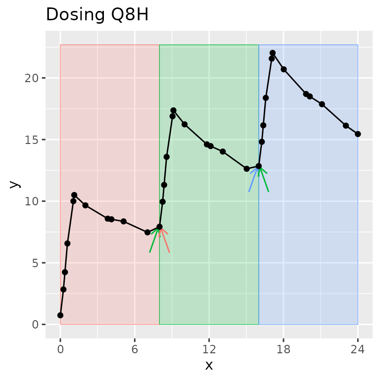
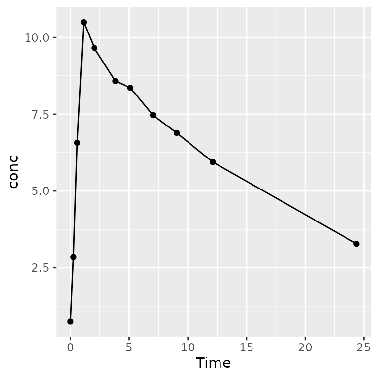

# PKNCA – an R package for noncompartmental analysis of pharmacokinetic data

## PKNCA – an R package for noncompartmental analysis of pharmacokinetic data

### Introduction to PKNCA

PKNCA is a tool for calculating noncompartmental analysis (NCA) results
for pharmacokinetic (PK) data.

… but, you already knew that or you wouldn’t be here.

PKNCA has several foci:

- be regulatory-ready
  - it has approximately 100% test coverage.
- be reproducible
  - it has a focus on being scriptable.
- get the right answer or none at all
  - it will try to know what you want,
  - but all decisions can be overridden, and
  - if there is a question that may cause an error or an unanticipated
    result, either no result will output or an error will be raised.

## Dataset Basics

### NCA Data are Not Tidy ***as a Single Dataset***

“Tidy datasets… have a specific structure: each variable is a column,
each observation is a row, and each type of observational unit is a
table.” - Hadley Wickham (<https://doi.org/10.18637/jss.v059.i10>)

CDISC has NCA tidied, and PKNCA follows that model:

- concentration-time is a dataset (PC domain;
  [`PKNCAconc()`](http://humanpred.github.io/pknca/reference/PKNCAconc.md)
  object)
- dose-time is a dataset (EX/EC domains;
  [`PKNCAdose()`](http://humanpred.github.io/pknca/reference/PKNCAdose.md)
  object)
- NCA results are a dataset (PP domain;
  [`pk.nca()`](http://humanpred.github.io/pknca/reference/pk.nca.md)
  output)

### Dataset Basics: What columns are needed?

Column names are provided by the input to
[`PKNCAconc()`](http://humanpred.github.io/pknca/reference/PKNCAconc.md)
and
[`PKNCAdose()`](http://humanpred.github.io/pknca/reference/PKNCAdose.md);
they are not hard-coded.

Columns that can be used include:

- [`PKNCAconc()`](http://humanpred.github.io/pknca/reference/PKNCAconc.md):
  concentration, time, groups; data exclusions; half-life inclusion and
  exclusion
- [`PKNCAdose()`](http://humanpred.github.io/pknca/reference/PKNCAdose.md):
  dose, time, groups; route, rate/duration of infusion; data exclusions
- intervals given to
  [`PKNCAdata()`](http://humanpred.github.io/pknca/reference/PKNCAdata.md):
  groups, start, end, and any NCA parameters to calculate

### Dataset Basics: Example interval data

``` r
d_interval_1 <-
  data.frame(
    start=0, end=8,
    cmax=TRUE, tmax=TRUE, auclast=TRUE
  )
```

| start | end | cmax | tmax | auclast |
|:-----:|:---:|:----:|:----:|:-------:|
|   0   |  8  | TRUE | TRUE |  TRUE   |

Groups are not required, if you want the same intervals calculated for
each group.

## PKNCA Functions

### What functions are the most used?

- [`PKNCAconc()`](http://humanpred.github.io/pknca/reference/PKNCAconc.md):
  define a concentration-time `PKNCAconc` object
  - All information about concentration data are given: concentration,
    time
  - Optional information includes: grouping information (usually given),
    data to exclude, half-life inclusion and exclusion columns
- [`PKNCAdose()`](http://humanpred.github.io/pknca/reference/PKNCAdose.md):
  define a dose-time `PKNCAdose` object (optional)
  - dose amount and time are both optional
  - Optional information includes: rate or duration of infusion, data to
    exclude
- [`PKNCAdata()`](http://humanpred.github.io/pknca/reference/PKNCAdata.md):
  combine `PKNCAconc`, optionally `PKNCAdose`, and optionally
  `intervals` into a `PKNCAdata` object
  - the `PKNCAconc` object must be given; the `PKNCAdose` object is
    optional; interval definitions are usually given; calculation
    options may be given
- [`pk.nca()`](http://humanpred.github.io/pknca/reference/pk.nca.md):
  calculate the NCA parameters from a data object into a `PKNCAresult`
  object

### How do I do a simple calculation? all steps

We will break this down in subsequent slides.

``` r
# Concentration data setup
d_conc <-
  datasets::Theoph |>
  filter(Subject %in% 1)
o_conc <- PKNCAconc(conc~Time, data=d_conc, timeu = "hr", concu = "mg/L")
# Dose data setup
d_dose <-
  datasets::Theoph |>
  filter(Subject %in% 1) |>
  filter(Time == 0)
o_dose <- PKNCAdose(Dose~Time, data=d_dose, doseu = "mg")
# Combine concentration and dose
o_data <- PKNCAdata(o_conc, o_dose)
# Calculate the results
o_result <- pk.nca(o_data)
```

### How do I do a simple calculation? Concentration data

``` r
# Load your dataset as a data.frame
d_conc <-
  datasets::Theoph |>
  filter(Subject %in% 1)
# Take a look at the data
pander::pander(head(d_conc, 2))
```

| Subject |  Wt  | Dose | Time | conc |
|:-------:|:----:|:----:|:----:|:----:|
|    1    | 79.6 | 4.02 |  0   | 0.74 |
|    1    | 79.6 | 4.02 | 0.25 | 2.84 |

``` r
# Define the PKNCAconc object indicating the concentration and time columns, the
# dataset, and any other options. Optionally include units.
o_conc <- PKNCAconc(conc~Time, data=d_conc, timeu = "hr", concu = "mg/L")
```

### How do I do a simple calculation? Dose data

``` r
# Load your dataset as a data.frame
d_dose <-
  datasets::Theoph |>
  filter(Subject %in% 1) |>
  filter(Time == 0)
# Take a look at the data
pander::pander(d_dose)
```

| Subject |  Wt  | Dose | Time | conc |
|:-------:|:----:|:----:|:----:|:----:|
|    1    | 79.6 | 4.02 |  0   | 0.74 |

``` r
# Define the PKNCAdose object indicating the dose amount and time columns, the
# dataset, and any other options. Optionally include units.
o_dose <- PKNCAdose(Dose~Time, data=d_dose, doseu = "mg")
```

### How do I do a simple calculation? Calculate results

``` r
# Combine the PKNCAconc and PKNCAdose objects.  You can add interval
# specifications and calculation options here.
o_data <- PKNCAdata(o_conc, o_dose)
# Calculate the results
o_result <- pk.nca(o_data)
```

### How do I do a simple calculation? Get results

To calculate summary statistics, use
[`summary()`](https://rdrr.io/r/base/summary.html); to extract all
individual-level results, use
[`as.data.frame()`](https://rdrr.io/r/base/as.data.frame.html).

The `"caption"` attribute of the summary describes how the summary
statistics were calculated for each parameter. (Hint:
[`pander::pander()`](https://rdrr.io/pkg/pander/man/pander.html) knows
how to use that to put the caption on a table in a report.)

The individual results contain the columns for start time, end time,
grouping variables (none in this example), parameter names, values, and
if the value should be excluded.

### How do I do a simple calculation? Get summary results

All results (summary or individual) can be output either in a
Quarto/Rmarkdown report or another file for reporting.

``` r
# Look at summarized results
pander::pander(summary(o_result), split.tables = Inf)
```

| Interval Start | Interval End | AUClast (hr\*mg/L) | Cmax (mg/L) | Tmax (hr) | Half-life (hr) | AUCinf,obs (hr\*mg/L) |
|:--------------:|:------------:|:------------------:|:-----------:|:---------:|:--------------:|:---------------------:|
|       0        |      24      |        92.4        |      .      |     .     |       .        |           .           |
|       0        |     Inf      |         .          |    10.5     |   1.12    |      14.3      |          215          |

AUClast, Cmax, AUCinf,obs: geometric mean and geometric coefficient of
variation; Tmax: median and range; Half-life: arithmetic mean and
standard deviation

### How do I do a simple calculation? Get individual results

Use [`as.data.frame()`](https://rdrr.io/r/base/as.data.frame.html) to
get the individual NCA parameter results.

``` r
# Look at individual results
pander::pander(head(
  as.data.frame(o_result),
  n=3
), split.tables = Inf)
```

| start | end | PPTESTCD | PPORRES | exclude | PPORRESU |
|:-----:|:---:|:--------:|:-------:|:-------:|:--------:|
|   0   | 24  | auclast  |  92.37  |   NA    | hr\*mg/L |
|   0   | Inf |   cmax   |  10.5   |   NA    |   mg/L   |
|   0   | Inf |   tmax   |  1.12   |   NA    |    hr    |

## PKNCA datasets

### How does PKNCA think about data?

Three types of data are inputs for calculation in PKNCA:

- concentration-time (`PKNCAconc`),
- dose-time (`PKNCAdose`), and
- intervals.

`PKNCAconc` and `PKNCAdose` objects can optionally have groups. The
groups in a `PKNCAdose` object must be the same or fewer than the groups
in `PKNCAconc` object (for example, all subjects in a treatment arm may
receive the same dose).

### What is an “interval” and how is it different than a “group”?

A **group** separates one full concentration-time profile for a subject
that you may ever want to consider at the same time. Usually, it groups
by study, treatment, analyte, and subject (other groups can be useful
depending on the study design).

An **interval** selects a time range within a **group**.

One time can be in zero or more intervals, but only zero or one group.
Intervals can be adjacent (0-12 and 12-24) or overlap (0-12 and 0-24).
In other words, one sample may be used in more than one interval, but
one sample will never be used in more than one group.

**Legend:** The group contains all points on the figure. Shaded regions
indicate intervals. Arrows indicate points shared between intervals
within the group.



## Reporting

### Best practices for Data -\> PKNCA -\> knitr/Quarto

[`summary()`](https://rdrr.io/r/base/summary.html) makes summary tables
using of NCA results;
[`pander::pander()`](https://rdrr.io/pkg/pander/man/pander.html) creates
a table with a caption.
[`as.data.frame()`](https://rdrr.io/r/base/as.data.frame.html) with the
NCA results makes a listing.

``` r
pander::pander(summary(o_result), split.tables = Inf)
```

| Interval Start | Interval End | AUClast (hr\*mg/L) | Cmax (mg/L) | Tmax (hr) | Half-life (hr) | AUCinf,obs (hr\*mg/L) |
|:--------------:|:------------:|:------------------:|:-----------:|:---------:|:--------------:|:---------------------:|
|       0        |      24      |        92.4        |      .      |     .     |       .        |           .           |
|       0        |     Inf      |         .          |    10.5     |   1.12    |      14.3      |          215          |

AUClast, Cmax, AUCinf,obs: geometric mean and geometric coefficient of
variation; Tmax: median and range; Half-life: arithmetic mean and
standard deviation

``` r
pander::pander(as.data.frame(o_result), split.tables = Inf)
```

### Graphics are intentionally not part of PKNCA, but there are some tricks that can help…

Generate all individual profiles using the groups that you defined using
the `ggtibble` package.

``` r
library(ggtibble)
```

    ## 
    ## Attaching package: 'ggtibble'

    ## The following objects are masked from 'package:ggplot2':
    ## 
    ##     %+%, ggsave

``` r
o_conc <-
  PKNCAconc(
    conc~Time|Subject,
    data=datasets::Theoph
  )
pk_figs <-
  ggtibble(
    as.data.frame(o_conc),
    aes(x = Time, y = conc),
    outercols = group_vars(o_conc),
    caption = "PK over time for subject {Subject}"
  ) +
  geom_line() +
  geom_point()
# knit_print(pk_figs)
knit_print(pk_figs[1,])
```



### Validation of PKNCA

PKNCA has an extensive testing and validation suite built-in. To run the
testing and validation suite of tests with a full report generated, see
the [PKNCA
Validation](http://humanpred.github.io/pknca/articles/v60-PKNCA-validation.md)
vignette.

### More information

The PKNCA GitHub page (<https://github.com/humanpred/pknca>) and the
vignettes linked from there have examples and details.

To ask questions or get help, the discussion and issues sections of the
GitHub website are available to get help from the community or from me.

Thank you to all of the people who have used, contributed to, published
with, and asked questions about PKNCA over the last \>10 years!
